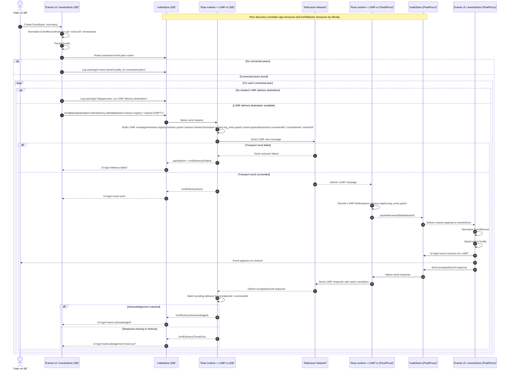

# Event Flow Architecture

This diagram shows the end-to-end mobile event replication flow over LXMF, including local creation, peer LXMF destination resolution, Community Hub-compatible mission payload transport, receiver-side application, and acknowledgement handling.

