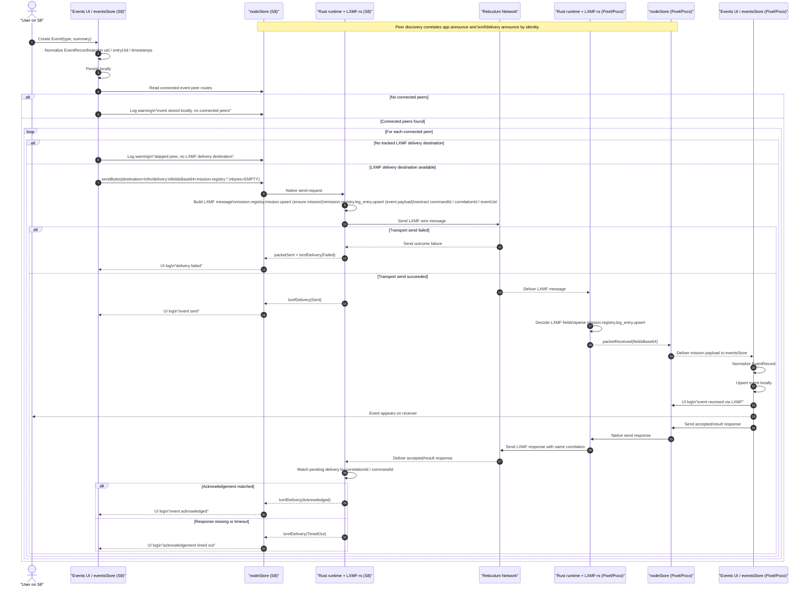
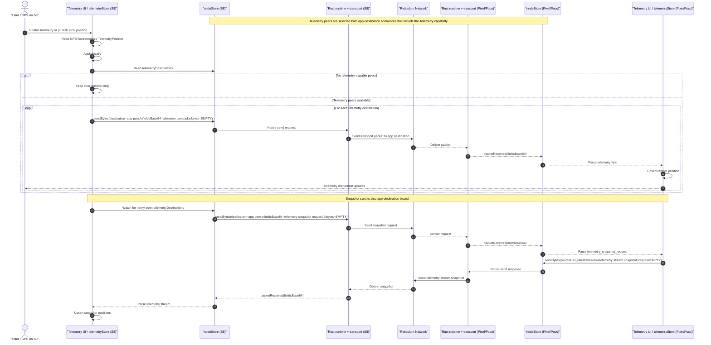

# Event And Telemetry Flow Architecture

This diagram shows the end-to-end mobile event replication flow over LXMF, including local creation, peer LXMF destination resolution, Community Hub-compatible mission payload transport, receiver-side application, and acknowledgement handling.

Current mobile behavior differs from the older store-centric sketch below in two important ways:
- Rust now owns local `upsert_eam` and `upsert_event` replication scheduling. The Vue stores persist locally by calling the native command surface; Rust immediately selects mission-capable peer targets and enqueues LXMF sends.
- When an EAM is created without explicit `team_member_uid` or `team_uid`, Rust fills `team_member_uid` from the local app destination hash and fills `team_uid` from a fixed team-color hash table before persisting and replicating the record.
- The Rust runtime restores saved peers into the managed set during startup before the first status/peer snapshot is exposed to the app, so immediate post-launch sends use intentional peers instead of waiting for later TypeScript auto-connect work.
- Event and EAM replication use intentional native fanout: they never target merely discovered peers, and each target send is handled independently so one unavailable peer does not block the rest. Direct sends target saved or explicitly managed peers that are mission-ready and currently direct-reachable (`active_link`, `communication_ready`, or native `Connected` state). If a saved peer is not directly reachable and a propagation relay is active, Rust sends that target via propagation instead of stalling on direct delivery first. The Rust send path resolves the peer's LXMF destination at send time even if the current peer snapshot no longer carries `lxmf_destination_hex`.
- RCH compatibility is mode-driven. `Autonomous` preserves local discovery/direct fanout. `SemiAutonomous` refreshes a transient hub directory by sending `rem.registry.peers.list` in LXMF `FIELD_COMMANDS (0x09)` to the selected RCH and then uses those returned peers for direct sends. `Connected` sends outbound traffic only to the selected RCH, and an `effective_connected_mode=true` hub response temporarily upgrades `SemiAutonomous` to connected routing.



This diagram shows the end-to-end mobile telemetry replication flow. Telemetry routing is mode-aware: in `Autonomous` it uses peers that advertise the `Telemetry` capability on the app destination, in `SemiAutonomous` it can target the latest hub-directory peers returned by RCH, and in `Connected` it sends only to the selected RCH.



## Flow Differences

- Telemetry routes from `telemetryDestinations`; in `Autonomous` that list is announce-driven, in `SemiAutonomous` it can be seeded from the latest RCH directory snapshot, and in `Connected` it collapses to the selected hub destination.
- Event direct sends can be local-peer fanout (`Autonomous`), hub-directory fanout (`SemiAutonomous`), or single-hop-to-RCH (`Connected`).
- Telemetry sends compact telemetry fields directly and the receiver parses them immediately from `packetReceived`; events send Community Hub-style `mission.registry.log_entry.*` LXMF messages.
- Telemetry has no delivery acknowledgement requirement in the app flow; events depend on a result/event reply to transition from `Sent` to `Acknowledged`.
- Telemetry snapshot sync uses a lightweight `telemetry_snapshot_request` / stream response over app destinations; event sync uses `mission.registry.log_entry.list` / `listed` style command-response semantics.
- Telemetry works even when only the app-destination route is healthy; events additionally require the peer's `lxmf/delivery` destination to be announced, tracked, routable, and correlation replies to come back correctly.
- Telemetry failures are mostly silent transport misses unless packet send throws; events now surface explicit `Sent`, `Acknowledged`, `Failed`, and `TimedOut` lifecycle states in the UI log.

## Payloads And Transport

### EmergencyMessage

Primary payload:

```json
{
  "kind": "message_upsert",
  "message": {
    "callsign": "emergency-ops-S8",
    "groupName": "Red",
    "securityStatus": "Green",
    "capabilityStatus": "Yellow",
    "preparednessStatus": "Unknown",
    "medicalStatus": "Green",
    "mobilityStatus": "Green",
    "commsStatus": "Green",
    "notes": "optional",
    "updatedAt": 1741891234567
  }
}
```

Additional message forms:
- `{"kind":"message_delete","callsign":"...","deletedAt":<ms>}`
- `{"kind":"snapshot_request","requestedAt":<ms>}`
- `{"kind":"snapshot_response","requestedAt":<ms>,"messages":[ActionMessage,...]}`

Transport:
- Sent with `nodeStore.broadcastJson(...)` for live upserts and deletes.
- Sent with `nodeStore.sendJson(destination, ...)` for snapshot request/response.
- This is **not LXMF**.
- The runtime sends a raw Reticulum transport packet because `sendJson` and `broadcastJson` only provide UTF-8 JSON bytes and no `fieldsBase64`.
- On the wire the payload is a UTF-8 JSON body parsed by `parseReplicationEnvelope(...)`.
- LXMF fields used: none.

Routing:
- Native `upsert_event()` fanout never includes merely discovered peers.
- Event direct sends are scoped to saved or explicitly managed peers that are mission-ready and direct-reachable (`active_link=true`, `communication_ready=true`, or native `state=Connected`).
- Saved peers that are not currently direct-reachable are sent via propagation when an active relay is available; merely discovered peers are never used as relay targets.
- Each event target is attempted independently. One target timing out or returning a network error does not cancel the other target attempts.
- Broadcast or direct send over the peer's **app destination** (`r3akt/emergency` path).

### Event

Primary payload:
- Local `EventRecord` is normalized into a Community Hub-compatible `mission.registry.log_entry.upsert` command.
- The command is placed inside an array carried in LXMF `FIELD_COMMANDS (0x09)`.
- This matches the Hub model documented in `Reticulum-Telemetry-Hub/docs/architecture/LXMFfields.md`, where `FIELD_COMMANDS` contains command structures.

Hub-compatible command array shape:

```json
[
  {
    "command_id": "cmd-123",
    "source": {
      "rns_identity": "<sender-identity>"
    },
    "timestamp": "2026-03-13T12:00:00Z",
    "command_type": "mission.registry.log_entry.upsert",
    "args": {
      "mission_uid": "mission-1",
      "content": "Operator note",
      "callsign": "EAGLE-1"
    },
    "correlation_id": "ui-save-42",
    "topics": ["mission-1", "audit"]
  }
]
```

Field placement:
- LXMF `0x09` (`FIELD_COMMANDS`): array of command envelopes like the example above
- LXMF `0x0A` (`FIELD_RESULTS`): accepted/result/rejected response payload
- LXMF `0x0D` (`FIELD_EVENT`): emitted event envelope such as `mission.registry.log_entry.upserted`

Mobile-specific note:
- The mobile app currently often includes additional event args such as `entry_uid`, `server_time`, `client_time`, `keywords`, `content_hashes`, and may include `source.display_name`.
- Those are extra fields inside the same Hub command structure; the core transport contract is still an array of commands inside `FIELD_COMMANDS`.

Implementation mapping:
- `apps/mobile/src/stores/eventsStore.ts` persists events in the same RCH envelope shape used on the wire.
- `apps/mobile/src/utils/missionSync.ts` serializes the command array with `msgpackr.pack(new Map([[0x09, commands]]))`, then base64-encodes the raw MsgPack bytes.
- `packages/node-client/src/index.ts` forwards `fieldsBase64` unchanged to the Capacitor plugin in `sendBytes(...)`.
- `crates/reticulum_mobile/src/jni_bridge.rs` base64-decodes `fields_base64` into `Vec<u8>` and passes those raw bytes to `node.send_bytes(...)`.
- `crates/reticulum_mobile/src/runtime.rs` does not transform field names on send. It deserializes the raw MsgPack bytes into `message.fields` and separately reads metadata from the same byte slice using `parse_mission_sync_metadata(...)`.
- Because the bridge passes raw MsgPack bytes through untouched, snake_case field names such as `command_id`, `command_type`, `correlation_id`, `mission_uid`, and `entry_uid` arrive in Rust exactly as produced by TypeScript.

Additional event forms:
- Mission bootstrap command:
  - `command_type: "mission.registry.mission.upsert"`
- Event list request:
  - `command_type: "mission.registry.log_entry.list"`
- Accepted/result response:
  - `status: "accepted" | "result" | "rejected"`
- Receiver-side event envelope:
  - `event_type: "mission.registry.log_entry.upserted" | "mission.registry.log_entry.listed"`

Transport:
- Sent with `nodeStore.sendBytes(destination, EMPTY_BYTES, { fieldsBase64 })`.
- This **is LXMF**.
- In the runtime, any `sendBytes(...)` call that includes `fieldsBase64` is wrapped into an LXMF message and sent to the peer's **`lxmf/delivery` destination**.
- The body bytes are empty for the mission-sync event path; the meaningful data is in the LXMF fields map.
- On Android, the Capacitor `send` bridge is enqueue-only for mission/LXMF sends. The plugin resolves as soon as Rust accepts the work, and later `lxmfDelivery` / `messageUpdated` / `error` events from Rust own timeout and failure reporting. TypeScript does not run a separate transport timeout for Event or EAM sends.

Verification:
- `npm --workspace apps/mobile run typecheck`
- `npm --workspace apps/mobile run build:web`
- `npx playwright test e2e/events.spec.ts`
- `cargo test -p reticulum_mobile parse_mission_sync_metadata`
- The Rust test suite now includes a full-RCH-envelope case that exercises `source`, `timestamp`, `args`, `correlation_id`, and `topics` through `parse_mission_sync_metadata(...)`.

Routing:
- Direct LXMF send to the peer's separately announced **`lxmf/delivery` destination**.
- If the peer is known but is not currently direct-deliverable and an active propagation relay is available, the sender skips direct retries and hands the LXMF message to propagation immediately.
- If the sender starts on a direct-capable route, the runtime still performs up to 3 direct attempts before falling back to propagation.

Acknowledgement:
- Sender success is tracked from the LXMF response path, not just packet send.
- The runtime marks delivery `Acknowledged` when it receives a matching response/event on the same `correlation_id` or `command_id`.

### Telemetry

Telemetry has two active wire formats in the app today.

Primary live upsert payload:
- Local `TelemetryPosition` is encoded into a compact MsgPack telemetry payload and placed into LXMF fields.

Logical telemetry position:

```json
{
  "callsign": "<sender lxmf hash or local callsign>",
  "lat": 44.6488,
  "lon": -63.5752,
  "alt": 12.3,
  "course": 180.0,
  "speed": 0.5,
  "accuracy": 4.2,
  "updatedAt": 1741891234567
}
```

Compact telemetry payload content:
- MsgPack map with:
  - `0x01` (`SID_TIME`) -> Unix timestamp seconds
  - `0x02` (`SID_LOCATION`) -> array:
    1. latitude as signed int32 microdegrees
    2. longitude as signed int32 microdegrees
    3. altitude as uint32 centimeters
    4. speed as uint32 centi-units
    5. course as uint32 centi-degrees
    6. accuracy as uint16 centimeters
    7. timestamp seconds

Snapshot response payload:
- LXMF telemetry stream field containing entries of:
  - `[peerHashBytes, timestampSeconds, telemetryPayloadBytes]`

Legacy delete / compatibility payload:

```json
{
  "kind": "telemetry_delete",
  "callsign": "<callsign>",
  "deletedAt": 1741891234567
}
```

Transport:
- Live upsert:
  - sent with `nodeStore.sendBytes(destination, EMPTY_BYTES, { fieldsBase64 })`
  - this **is LXMF**
  - routed to the peer's **app destination** selected from `telemetryDestinations`
- Snapshot request and snapshot response:
  - sent with `sendBytes(..., { fieldsBase64 })`
  - this **is LXMF**
  - also routed to the peer's **app destination**
- Delete compatibility path:
  - sent with `nodeStore.sendJson(destination, message, dedicatedFields)`
  - this is **raw RNS direct**, not LXMF

LXMF fields used:
- `0x02` (`LXMF_FIELD_TELEMETRY`): single telemetry upsert payload
- `0x03` (`LXMF_FIELD_TELEMETRY_STREAM`): snapshot response stream entries
- `0x09` (`LXMF_FIELD_COMMANDS`): snapshot request command list with command id `1`

Dedicated raw-field keys used for compatibility delete/upsert parsing:
- `telemetry.kind`
- `telemetry.callsign`
- `telemetry.lat`
- `telemetry.lon`
- `telemetry.alt`
- `telemetry.course`
- `telemetry.speed`
- `telemetry.accuracy`
- `telemetry.updatedAt`
- `telemetry.deletedAt`

Routing:
- Telemetry uses the peer's **app destination** when that peer advertises the `Telemetry` capability.

### LXMF SDK Bridge

`crates/reticulum_mobile/src/sdk_bridge.rs` is now the single SDK-facing boundary for the Rust node runtime.

Current wiring:
- `runtime.rs` still owns the transport lifecycle, peer discovery, and UniFFI event emission.
- Outbound LXMF event sends now go through `RuntimeLxmfSdk`, which wraps `lxmf-sdk`'s `Client<CompatBackend>`.
- `CompatBackend` is a compatibility backend that implements the upstream `SdkBackend` contract against the existing local `reticulum-rs` transport and `lxmf` wire encoder.
- Inbound packet reception, announce ingestion, peer state changes, hub-directory refreshes, and delivery-status transitions are mirrored into the SDK event/status model so send, receive, and delivery tracking share one internal SDK layer.

Payload mapping:
- `SendRequest.payload` carries the outbound content as base64 JSON.
- `SendRequest.extensions["reticulum.raw_bytes_base64"]` preserves the raw message bytes used to build the LXMF message body.
- `SendRequest.extensions["reticulum.fields_base64"]` preserves the original MsgPack LXMF fields without changing field names or structure.
- Delivery tracking maps app-visible states onto SDK states:
  - `Sent` -> `DeliveryState::Sent`
  - `Acknowledged` -> `DeliveryState::Delivered`
  - `Failed` -> `DeliveryState::Failed`
  - `TimedOut` -> `DeliveryState::Expired`

Rollback gate:
- The default build uses the SDK-backed path.
- `cargo test -p reticulum_mobile --features legacy-lxmf-runtime` keeps the previous direct send implementation available for one release cycle.

## Mobile Runtime Ownership Status

The mobile runtime is now moving toward a Rust-authoritative projection model on device:

- Rust owns the native app-state store, projection versioning, and `ProjectionInvalidated` events.
- Mobile settings, saved peers, EAMs, events, telemetry positions, and conversation/message projections are queried from native state on mobile builds.
- Peer availability on mobile now follows the configured stale window instead of a short announce-freshness heuristic. A peer can remain `Ready` without a fresh announce while its app and LXMF destinations are still known and the configured stale window has not expired; `active_link` is tracked separately from availability.
- Native `connectPeer()` now does more than request a route: it resolves the saved peer destination, opens an output link, and waits for `LinkEvent::Activated` before the runtime treats that peer as having a direct active link.
- TypeScript stores on mobile are being reduced to:
  - view filters and drafts
  - command dispatch
  - query refresh after projection invalidation
  - platform-only concerns such as geolocation permission UX
- UI-only preferences such as `clientMode` and `showOnlyCapabilityVerified` remain in TypeScript storage and are not part of the native `AppSettingsRecord`.
- Fresh installs and empty legacy TCP selections normalize to the first entry in `TCP_COMMUNITY_SERVERS`, so mobile starts with an active TCP community server selected by default.
- The legacy `rmap.world:4242` placeholder is treated as unset and is normalized to that first community server during migration and settings persistence.
- Pre-start app-state/projection queries are valid through the JNI bridge; only runtime transport commands still require an initialized node.
- Route-level views no longer own startup orchestration. `App.vue` coordinates node startup before store refreshes that depend on runtime state.
- Saved peers are rehydrated into the Rust managed-peer set during runtime startup, so the app does not depend on a later UI-driven connect pass before EAM/Event/message sends can target intentional peers.

This cutover is incomplete. Telemetry permission/fix acquisition still originates in TypeScript, and remaining long-session validation must prove that every operational lifecycle is fully native-owned.

## UniFFI Code Generation

The repo now carries a local workspace runner for UniFFI CLI generation:

- package: `tools/uniffi-bindgen`
- binary: `reticulum_mobile_uniffi_bindgen`

`tools/codegen/generate-uniffi-bindings.ps1` uses this order:

1. use `uniffi-bindgen` from `PATH` if it exists
2. otherwise run the workspace fallback:
   - `cargo run -p reticulum_mobile_uniffi_bindgen -- generate --language <swift|kotlin> ...`

This avoids relying on a globally installed `uniffi-bindgen` executable, which is not always present with the UniFFI `0.28.x` crate layout used by this repo.
