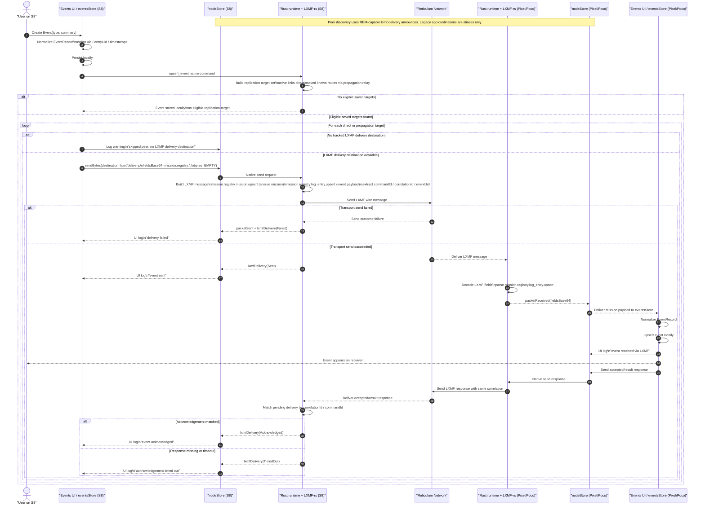
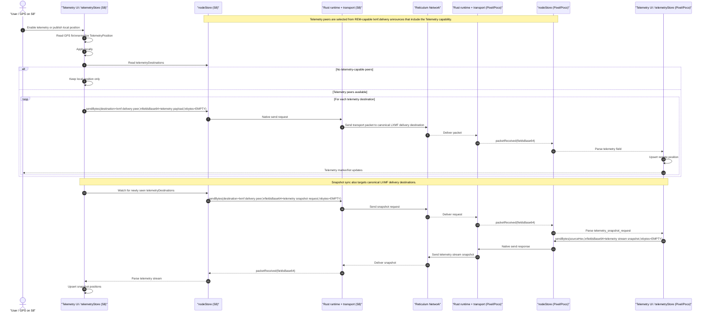

# Event And Telemetry Flow Architecture

For the current Rust, Android, NodeStore, node-client, and Vue module ownership
boundaries, see [`runtime-modules.md`](runtime-modules.md). The executable
responsiveness and source-size invariants described there apply to every flow
in this document.

This diagram shows the end-to-end mobile event replication flow over LXMF, including local creation, peer LXMF destination resolution, Community Hub-compatible mission payload transport, receiver-side application, and acknowledgement handling.

Current mobile behavior differs from the older store-centric sketch below in two important ways:
- Rust now owns local `upsert_eam` and `upsert_event` replication scheduling. The Vue stores persist locally by calling the native command surface; Rust immediately selects mission-capable peer targets and enqueues LXMF sends.
- When an EAM is created without explicit `team_member_uid` or `team_uid`, Rust fills the member linkage from the local identity and the currently active canonical team before persisting and replicating the record.
- The Rust runtime restores saved peers into the managed set during startup before the first status/peer snapshot is exposed to the app, so immediate post-launch sends use intentional peers instead of waiting for later TypeScript auto-connect work.
- Saved peers persist a durable route profile when one is known: canonical LXMF delivery destination, identity, REM capability app data, display name, route timestamp, and hop count. The runtime can rebuild a stale saved peer from that profile after restart or missed announces, which lets propagation planning target the peer without waiting for a fresh peer snapshot.
- Event and EAM replication use intentional native fanout: they never target merely discovered peers, and each target send is handled independently so one unavailable peer does not block the rest. Direct sends require a live managed LXMF link (`active_link=true` with native `Connected` state). Saved peers with known LXMF routes use propagation when an active relay is available, rather than being labeled as direct candidates from a recent announce alone. The Rust send path resolves the peer's LXMF destination at send time even if the current peer snapshot no longer carries `lxmf_destination_hex`.
- RCH compatibility is mode-driven. `Autonomous` preserves local discovery/direct fanout. `SemiAutonomous` periodically refreshes a TEAM-scoped hub directory by sending `rem.registry.team_peers.list` in LXMF `FIELD_COMMANDS (0x09)` to the selected RCH. The latest successful directory is a local membership allowlist: routing intersects it with locally observed announce/link state instead of trusting hub presence labels or querying the hub during each send. Refresh failures retain the last successful directory; a node that has never received a valid directory still fails closed for RCH-owned recipients. In `Connected`, local members still use their direct routes while the same-color RCH roster is sent through the selected hub; an `effective_connected_mode=true` hub response temporarily applies that split routing to `SemiAutonomous`.
- SOS uses the same numeric LXMF command slot in this repo: `FIELD_COMMANDS (0x09)`. The shared Rust constants are the source of truth, and the runtime separates SOS from RCH by envelope keys (`sos_state` / `incident_id` vs `command_type` / `command_id`). The earlier SOS note that said `FIELD_COMMANDS (0x06)` is stale for the current REM/RCH wire contract.

## Local And RCH Multi-Team Routing

RCH owns shared TEAM membership. Its version 2 `rem.registry.team_peers.list`
response carries canonical team records, the caller's team/member linkages, a
durable REM-member roster, and the unchanged legacy `items` list. REM accepts
only the 13 canonical color-team UIDs. Yellow is always available and is the
default; legacy flat responses are interpreted as Yellow.

REM persists the last valid RCH directory under the selected hub identity. A hub
change cannot reuse another hub's cache, and a refresh failure does not erase a
valid cache. If an authoritative refresh removes the selected team, REM returns
to Yellow and emits an operational notice unless the same color exists locally.
RCH membership remains read-only in REM. Local membership, the active team, and
optional aliases are editable; aliases are never placed in LXMF fields, mission
command arguments, or exported team data.

The active team scopes every outbound recipient set while all local timelines
remain shared. REM can create any of the 13 canonical color teams and assign a
saved peer to several local colors. Existing saved peers migrate once to local
Yellow. A local roster and an RCH roster with the same canonical UID appear as
one merged section and one deduplicated recipient set. Autonomous and
Semi-autonomous modes intersect the selected roster with local announce/link
state. Connected mode sends local members directly and sends the RCH-owned
portion through the configured hub after validating caller membership. An
empty merged roster fails closed.

Local teams can be exported as versioned JSON and imported on another REM
client. Import merges membership by canonical color UID, creates saved peer
records as needed, and never overwrites the receiving device's local alias.
The QR path carries a compact form of the same version 1 JSON envelope, limited
to 40 member destinations so one code remains reliably scannable. It excludes
local aliases and peer labels. The receiving client scans only QR format,
validates the schema, canonical UID, member count, and every destination, then
uses the same merge path as pasted JSON. Android scanning uses the offline
ZXing backend and requires API 26 or newer.

Every team-scoped mission, checklist, telemetry, chat, EAM, and SOS send carries
the canonical team UID in LXMF `FIELD_GROUP (0x0B)`. RCH validates the caller's
membership and constrains Connected-mode fanout to that team. Switching teams
tombstones the local EAM in the previous team and republishes its retained
status values with the new linkage; local switching and persistence still work
while the transport is offline.


```mermaid
sequenceDiagram
    autonumber
    actor User as "User on S8"
    participant S8UI as "Events UI / eventsStore (S8)"
    participant S8Node as "nodeStore (S8)"
    participant S8RT as "Rust runtime + LXMF-rs (S8)"
    participant RNS as "Reticulum Network"
    participant PRT as "Rust runtime + LXMF-rs (Pixel/Poco)"
    participant PNode as "nodeStore (Pixel/Poco)"
    participant PUI as "Events UI / eventsStore (Pixel/Poco)"

    Note over S8Node,PNode: Peer discovery uses REM-capable lxmf.delivery announces. Legacy app destinations are aliases only.

    User->>S8UI: Create Event(type, summary)
    S8UI->>S8UI: Normalize EventRecord\nassign uid / entryUid / timestamps
    S8UI->>S8UI: Persist locally

    S8UI->>S8RT: upsert_event native command
    S8RT->>S8RT: Build replication target set\nactive links direct\nsaved known routes via propagation relay
    alt No eligible saved targets
        S8RT-->>S8UI: Event stored locally\nno eligible replication target
    else Eligible saved targets found
        loop For each direct or propagation target
            alt No tracked LXMF delivery destination
                S8UI->>S8Node: Log warning\n"skipped peer, no LXMF delivery destination"
            else LXMF delivery destination available
                S8UI->>S8Node: sendBytes(destination=lxmf/delivery,\nfieldsBase64=mission.registry.*,\nbytes=EMPTY)
                S8Node->>S8RT: Native send request
                S8RT->>S8RT: Build LXMF message\nmission.registry.mission.upsert (ensure mission)\nmission.registry.log_entry.upsert (event payload)\nextract commandId / correlationId / eventUid
                S8RT->>RNS: Send LXMF wire message

                alt Transport send failed
                    RNS-->>S8RT: Send outcome failure
                    S8RT-->>S8Node: packetSent + lxmfDelivery(Failed)
                    S8Node-->>S8UI: UI log\n"delivery failed"
                else Transport send succeeded
                    RNS-->>PRT: Deliver LXMF message
                    S8RT-->>S8Node: lxmfDelivery(Sent)
                    S8Node-->>S8UI: UI log\n"event sent"

                    PRT->>PRT: Decode LXMF fields\nparse mission.registry.log_entry.upsert
                    PRT-->>PNode: packetReceived(fieldsBase64)
                    PNode-->>PUI: Deliver mission payload to eventsStore
                    PUI->>PUI: Normalize EventRecord
                    PUI->>PUI: Upsert event locally
                    PUI->>PNode: UI log\n"event received via LXMF"
                    PUI-->>User: Event appears on receiver

                    PUI->>PNode: Send accepted/result response
                    PNode->>PRT: Native send response
                    PRT->>RNS: Send LXMF response with same correlation
                    RNS-->>S8RT: Deliver accepted/result response
                    S8RT->>S8RT: Match pending delivery by correlationId / commandId

                    alt Acknowledgement matched
                        S8RT-->>S8Node: lxmfDelivery(Acknowledged)
                        S8Node-->>S8UI: UI log\n"event acknowledged"
                    else Response missing or timeout
                        S8RT-->>S8Node: lxmfDelivery(TimedOut)
                        S8Node-->>S8UI: UI log\n"acknowledgement timed out"
                    end
                end
            end
        end
    end
```

This diagram shows the end-to-end mobile telemetry replication flow. Telemetry routing is mode-aware: in `Autonomous` it uses peers that advertise the `Telemetry` capability in their REM-capable `lxmf.delivery` announce, in `SemiAutonomous` it can target the latest hub-directory peers returned by RCH, and in `Connected` it sends only to the selected RCH.


```mermaid
sequenceDiagram
    autonumber
    actor User as "User / GPS on S8"
    participant TUI as "Telemetry UI / telemetryStore (S8)"
    participant TNode as "nodeStore (S8)"
    participant TRT as "Rust runtime + transport (S8)"
    participant RNS as "Reticulum Network"
    participant RRT as "Rust runtime + transport (Pixel/Poco)"
    participant RNode as "nodeStore (Pixel/Poco)"
    participant RUI as "Telemetry UI / telemetryStore (Pixel/Poco)"

    Note over TNode,RNode: Telemetry peers are selected from REM-capable lxmf.delivery announces that include the Telemetry capability.

    User->>TUI: Enable telemetry or publish local position
    TUI->>TUI: Read GPS fix\nnormalize TelemetryPosition
    TUI->>TUI: Apply locally

    TUI->>TNode: Read telemetryDestinations
    alt No telemetry-capable peers
        TUI->>TUI: Keep local position only
    else Telemetry peers available
        loop For each telemetry destination
            TUI->>TNode: sendBytes(destination=lxmf delivery peer,\nfieldsBase64=telemetry payload,\nbytes=EMPTY)
            TNode->>TRT: Native send request
            TRT->>RNS: Send transport packet to canonical LXMF delivery destination
            RNS-->>RRT: Deliver packet
            RRT-->>RNode: packetReceived(fieldsBase64)
            RNode-->>RUI: Parse telemetry field
            RUI->>RUI: Upsert remote position
            RUI-->>User: Telemetry marker/list updates
        end
    end

    Note over TUI,RUI: Snapshot sync also targets canonical LXMF delivery destinations.
    TUI->>TNode: Watch for newly seen telemetryDestinations
    TNode->>TRT: sendBytes(destination=lxmf delivery peer,\nfieldsBase64=telemetry snapshot request,\nbytes=EMPTY)
    TRT->>RNS: Send snapshot request
    RNS-->>RRT: Deliver request
    RRT-->>RNode: packetReceived(fieldsBase64)
    RNode-->>RUI: Parse telemetry_snapshot_request
    RUI->>RNode: sendBytes(sourceHex,\nfieldsBase64=telemetry stream snapshot,\nbytes=EMPTY)
    RNode->>RRT: Native send response
    RRT->>RNS: Send telemetry stream snapshot
    RNS-->>TRT: Deliver snapshot
    TRT-->>TNode: packetReceived(fieldsBase64)
    TNode-->>TUI: Parse telemetry stream
    TUI->>TUI: Upsert snapshot positions
```

## Flow Differences

- Telemetry routes from `telemetryDestinations`; in `Autonomous` that list is announce-driven, in `SemiAutonomous` it is the intersection of the cached TEAM-scoped directory and locally current peers, and in `Connected` it collapses to the selected hub destination.
- Event direct sends can be local-peer fanout (`Autonomous`), hub-directory fanout (`SemiAutonomous`), or single-hop-to-RCH (`Connected`).
- Telemetry sends compact telemetry fields directly and the receiver parses them immediately from `packetReceived`; events send Community Hub-style `mission.registry.log_entry.*` LXMF messages.
- Standard LXMF transport proofs transition direct packet deliveries to `Delivered`. Telemetry has no additional application acknowledgement requirement; event and mission commands still depend on a `FIELD_RESULTS (0x0A)` result/event reply to transition from transport-delivered to application `Acknowledged`.
- Telemetry snapshot sync uses a lightweight `telemetry_snapshot_request` / stream response over canonical LXMF delivery destinations; event sync uses `mission.registry.log_entry.list` / `listed` style command-response semantics.
- Telemetry and events require the peer's REM-capable `lxmf.delivery` destination to be announced, tracked, routable, and correlation replies to come back correctly. Legacy app destinations are inbound compatibility aliases, not routing targets.
- REM capability parsing is centralized in the native runtime. New REM versions emit the standard LXMF delivery announce array (`display_name`, `stamp_cost`) with optional capability metadata in a third extension slot, and accept both that structured form and legacy REM text app data (`R3AKT,EMergencyMessages,Telemetry;name=...`). The app must not infer an LXMF route from a generic app destination.
- The structured capability metadata advertises `rem.standard_lxmf_receipts.v1`. A new REM sends the old `REM_DELIVERY_ACK:<message-id>` compatibility message only to a peer positively identified by a legacy text REM announce; it always continues to recognize that legacy response from current deployed REM versions.
- Telemetry failures are mostly silent transport misses unless packet send throws; events now surface explicit `Sent`, `Delivered`, `Acknowledged`, `Failed`, and `TimedOut` lifecycle states in the UI log.

## Checklist / Excheck Flow

Checklist state is Rust-authoritative. The Vue screens call the node-client checklist API, the Android bridge forwards those calls to the native service, and `crates/reticulum_mobile` persists checklist records before emitting projection invalidations. The UI refreshes `Checklists` and keyed `ChecklistDetail` projections instead of caching checklist state in the browser layer.

Checklist templates can be built in or imported from CSV. CSV import is handled in Rust. The importer accepts arbitrary normal columns and treats `CompletedDTG`, `Completed DTG`, `Due`, `DueRelativeDTG`, `Due Relative DTG`, `Due Relative Minutes`, or `Due Minutes` as the deadline column. REM stores that column as the pinned system column `DUE_RELATIVE_DTG` with relative task deadlines in `due_relative_minutes`. If the CSV does not include a deadline column, Rust creates one and applies the configured default deadline step, currently 30 minutes per row.

Bundled templates are seeded through the same Rust store and include the same pinned deadline column. Template seeding is an upsert so existing installs can receive updated built-in template definitions without deleting user-imported templates.

Live checklist deadlines are calculated from the checklist start DTG plus each task's `due_relative_minutes`. A pending task becomes late when the current time is after that due DTG. A completed task is `Complete Late` only when its `completed_at` timestamp is after the calculated due DTG. `CompletedDTG` is therefore a required-by deadline, not the actual completion timestamp.

Initial autonomous sharing uses packet-first replication:

- `checklist.create.online` carries the RCH-compatible checklist identity, template, participant, and count metadata. It deliberately omits descriptive metadata plus task and column snapshots so the create command remains packet-sized. The sender follows creation with the existing `checklist.update` command for description and start time, preserving metadata without changing the compact create envelope.
- Checklist column schema is fanned out as compact per-column `checklist.update` patches before row/cell data. This is required for new/non-template checklists where the receiver cannot hydrate columns from a local template.
- The initial rows are fanned out as compact `checklist.task.row.add` commands plus compact `checklist.task.cell.set` commands for non-empty cells, so the first sync can stay under the small LXMF packet budget instead of forcing resource transfer.
- `checklist.upload` remains available for full snapshot hydration. Its content uses `rem.checklist.snapshot.v2` with a `zlib+msgpack` snapshot body; receivers also accept the older uncompressed `rem.checklist.snapshot.v1` format.

Incremental collaboration keeps using the specific task commands:

- `checklist.task.row.add`
- `checklist.task.row.delete`
- `checklist.task.row.style.set`
- `checklist.task.cell.set`
- `checklist.task.status.set`

Large checklist snapshots use the existing LXMF resource-capable delivery path rather than a separate transport, but they are compressed before being placed in resource content. Smaller task edits send only the changed data. Incoming checklist commands update the Rust aggregate, emit `Checklists` and `ChecklistDetail` invalidations, and Android posts inbound checklist notifications through the same service notification path used by other operational updates.

## Payloads And Transport

### EmergencyMessage

Primary payload:

```json
{
  "kind": "message_upsert",
  "message": {
    "callsign": "emergency-ops-S8",
    "groupName": "Red",
    "securityStatus": "Green",
    "capabilityStatus": "Yellow",
    "preparednessStatus": "Unknown",
    "medicalStatus": "Green",
    "mobilityStatus": "Green",
    "commsStatus": "Green",
    "notes": "optional",
    "updatedAt": 1741891234567
  }
}
```

Additional message forms:
- `{"kind":"message_delete","callsign":"...","deletedAt":<ms>}`
- `{"kind":"snapshot_request","requestedAt":<ms>}`
- `{"kind":"snapshot_response","requestedAt":<ms>,"messages":[ActionMessage,...]}`

Transport:
- Sent with `nodeStore.broadcastJson(...)` for live upserts and deletes.
- Sent with `nodeStore.sendJson(destination, ...)` for snapshot request/response.
- This is **not LXMF**.
- The runtime sends a raw Reticulum transport packet because `sendJson` and `broadcastJson` only provide UTF-8 JSON bytes and no `fieldsBase64`.
- On the wire the payload is a UTF-8 JSON body parsed by `parseReplicationEnvelope(...)`.
- LXMF fields used: none.

Routing:
- Native `upsert_event()` fanout never includes merely discovered peers.
- Event direct sends are scoped to saved or explicitly managed peers that are mission-ready and have a live direct link (`active_link=true` and native `state=Connected`).
- Saved peers that are seen recently or have stored LXMF routes but no live direct link are sent via propagation when an active relay is available; the stored route can come from a persisted saved-peer profile even when no current peer record is available. Merely discovered peers are never used as relay targets.
- Each event target is attempted independently. One target timing out or returning a network error does not cancel the other target attempts.
- Broadcast or direct send over the peer's canonical **`lxmf.delivery` destination** (`r3akt/emergency` payload path).

### Event

Primary payload:
- Local `EventRecord` is normalized into a Community Hub-compatible `mission.registry.log_entry.upsert` command.
- The command is placed inside an array carried in LXMF `FIELD_COMMANDS (0x09)`.
- This matches the Hub model documented in `Reticulum-Telemetry-Hub/docs/architecture/LXMFfields.md`, where `FIELD_COMMANDS` contains command structures.

Hub-compatible command array shape, expanded for readability:

```json
[
  {
    "command_id": "cmd-123",
    "source": {
      "rns_identity": "<sender-identity>"
    },
    "timestamp": "2026-03-13T12:00:00Z",
    "command_type": "mission.registry.log_entry.upsert",
    "args": {
      "mission_uid": "mission-1",
      "content": "Operator note",
      "callsign": "EAGLE-1"
    },
    "correlation_id": "ui-save-42",
    "topics": ["mission-1", "audit"]
  }
]
```

Field placement:
- LXMF `0x09` (`FIELD_COMMANDS`): array of command envelopes like the example above
- LXMF `0x0A` (`FIELD_RESULTS`): accepted/result/rejected response payload
- LXMF `0x0D` (`FIELD_EVENT`): emitted event envelope such as `mission.registry.log_entry.upserted`

Mobile-specific note:
- The mobile app currently often includes additional event args such as `entry_uid`, `server_time`, `client_time`, `keywords`, `content_hashes`, and may include `source.display_name`.
- Those are extra fields inside the same Hub command structure; the core transport contract is still an array of commands inside `FIELD_COMMANDS`.
- Native REM peer-to-peer replication uses compact aliases for small LXMF packets:
  - `i` = `command_id`
  - `c` = `correlation_id`
  - `t` = `command_type`
  - `s.r` = `source.rns_identity` (hex string or 16-byte binary identity)
  - `s.n` = `source.display_name`
  - `ts` = `timestamp` (RFC3339 string or millisecond epoch integer)
  - `a` = `args`
  - `to` = `topics`
- Parsers accept both the expanded names and compact aliases. TypeScript hub bootstrap may still emit expanded names for hub compatibility.
- Known command types use alphanumeric wire codes in native compact packets:
  - `E1` = `mission.registry.log_entry.upsert`
  - `E2` = `mission.registry.log_entry.upserted`
  - `M1` = `mission.registry.eam.upsert`
  - `M2` = `mission.registry.eam.delete`
  - `M3` = `mission.registry.eam.upserted`
  - `T1` = `mission.registry.telemetry.upsert`
  - `S1` = `sos.status`
  - `C1`..`CA` = checklist create/upload/update/delete/join/task commands
- Checklist command args also use compact aliases in native peer-to-peer packets. Common examples are `cl` = `checklist_uid`, `m` = `mission_uid`, `tp` = `template_uid`, `tsk` = `task_uid`, `col` = `column_uid`, `v` = `value`, `us` = `user_status`, `pa` = `patch`, and `sn` / `sj` = snapshot payload fields. Parsers accept both the compact and expanded arg names. Full checklist snapshots are serialized as MsgPack and then zlib-compressed inside `rem.checklist.snapshot.v2`; older uncompressed snapshot content remains readable.

Implementation mapping:
- `apps/mobile/src/stores/eventsStore.ts` persists events in the same RCH envelope shape used on the wire.
- `apps/mobile/src/utils/missionSync.ts` serializes TypeScript-originated command arrays with `msgpackr.pack(new Map([[0x09, commands]]))`, then base64-encodes the raw MsgPack bytes. It parses both expanded and compact command envelopes.
- `packages/node-client/src/index.ts` forwards `fieldsBase64` unchanged to the Capacitor plugin in `sendBytes(...)`.
- `crates/reticulum_mobile/src/jni_bridge.rs` base64-decodes `fields_base64` into `Vec<u8>` and passes those raw bytes to `node.send_bytes(...)`.
- `crates/reticulum_mobile/src/node.rs` builds native REM replication packets directly and uses compact command aliases/codes for event, EAM, telemetry, checklist, and SOS traffic.
- `crates/reticulum_mobile/src/runtime.rs` deserializes raw MsgPack bytes into `message.fields` and separately reads metadata from the same byte slice using `parse_mission_sync_metadata(...)`.

MECP event body contract:
- REM event content uses compact MECP text in `args.content`, for example `MECP/2/P01 #A1`.
- Packet-efficient event replication may omit the `MECP/2/` prefix on the wire. Receivers restore it before native persistence, and the timeline accepts legacy stored compact bodies such as `H01 water cache` so the code and trailing details remain parseable.
- The event type keyword remains the MECP category selector, stored as `r3akt:event-type:<category>`.
- Sender and time remain canonical in the REM envelope through `args.callsign`, `args.server_time`, `args.client_time`, and projection timestamps. Outbound REM events must not duplicate callsign or timestamp tokens inside the MECP body.
- The MECP codec may decode portable external callsign or timestamp tokens when they are received, but timeline display still prefers the REM envelope for callsign and time.

Additional event forms:
- Mission bootstrap command:
  - `command_type: "mission.registry.mission.upsert"`
- Event list request:
  - `command_type: "mission.registry.log_entry.list"`
- Accepted/result response:
  - `status: "accepted" | "result" | "rejected"`
- Receiver-side event envelope:
  - `event_type: "mission.registry.log_entry.upserted" | "mission.registry.log_entry.listed"`

Transport:
- Sent with `nodeStore.sendBytes(destination, EMPTY_BYTES, { fieldsBase64 })`.
- This **is LXMF**.
- In the runtime, any `sendBytes(...)` call that includes `fieldsBase64` is wrapped into an LXMF message and sent to the peer's **`lxmf/delivery` destination**.
- The body bytes are empty for the mission-sync event path; the meaningful data is in the LXMF fields map.
- On Android, the Capacitor `send` bridge is enqueue-only for mission/LXMF sends. The plugin resolves as soon as Rust accepts the work, and later `lxmfDelivery` / `messageUpdated` / `error` events from Rust own timeout and failure reporting. TypeScript does not run a separate transport timeout for Event or EAM sends.
- Scheduler capacity is separated by delivery intent. Direct and Auto SOS status traffic uses the reserved recovery lane; propagation-only SOS recipients use the propagation lane. A slow or stale propagation fanout therefore cannot occupy every permit needed by a reachable direct emergency peer.

Verification:
- `npm --workspace apps/mobile run typecheck`
- `npm --workspace apps/mobile run build:web`
- `npx playwright test e2e/events.spec.ts`
- `cargo test --manifest-path crates/reticulum_mobile/Cargo.toml parse_mission_sync_metadata`
- The Rust test suite now includes a full-RCH-envelope case that exercises `source`, `timestamp`, `args`, `correlation_id`, and `topics` through `parse_mission_sync_metadata(...)`.

Routing:
- Direct LXMF send to the peer's separately announced **`lxmf/delivery` destination**.
- Chat uses `Auto` for saved peers with a known LXMF route and an active propagation relay, so Reticulum can try direct delivery when available and fall back to propagation instead of failing at the UI direct-link gate. Without a relay-backed saved route, chat keeps the direct connection flow and sends `DirectOnly`.
- Generic peer chat keeps the selected peer as the LXMF destination in Connected RCH mode. Hub routing is reserved for mission, event, and telemetry replication payloads that are explicitly hub-scoped.
- If the peer is known but is not currently direct-deliverable and an active propagation relay is available, the sender skips direct retries and hands the LXMF message to propagation immediately.
- If the sender starts on a direct-capable route, the runtime still performs up to 3 direct attempts before falling back to propagation.

Acknowledgement:
- Direct packet delivery is tracked with the regular Reticulum/LXMF proof lifecycle. A valid proof marks transport state `Delivered`; completed direct resource transfer is also transport-delivered. Handoff to a propagation node remains `SentToPropagation`, since a relay receipt is not proof of final-recipient delivery.
- The runtime marks application state `Acknowledged` when it receives a matching standard LXMF `FIELD_RESULTS (0x0A)` response/event on the same `correlation_id` or `command_id`.
- Plain chat does not require an application result. Current deployed REM clients still interoperate through the legacy text announce and `REM_DELIVERY_ACK` compatibility branch described above.

### LXMF Command Field Compatibility

The current REM mobile wire contract intentionally shares the same numeric command field across multiple payload families:

- `crates/reticulum_mobile/src/lxmf_fields.rs` is the Rust source of truth for:
  - `FIELD_COMMANDS = 0x09`
  - `FIELD_RESULTS = 0x0A`
  - `FIELD_EVENT = 0x0D`
- RCH-compatible mission/Event/EAM envelopes use `FIELD_COMMANDS (0x09)` with expanded keys such as `command_id`, `correlation_id`, `command_type`, and `args`, or compact aliases such as `i`, `c`, `t`, and `a`.
- SOS uses that same `FIELD_COMMANDS (0x09)` slot. Native REM emits the compact command code `S1` and compact SOS keys (`ss`, `ii`, `tr`, `sm`, optional `au`), while the parser still accepts legacy expanded keys.
- Telemetry snapshot requests also reuse `FIELD_COMMANDS (0x09)` as a small command list sent over the canonical LXMF delivery destination.

Parser separation is deliberate and happens by envelope shape, not by allocating different numeric field IDs:

- `crates/reticulum_mobile/src/mission_sync.rs` now treats a `0x09` entry as mission-sync only when a command envelope exposes mission markers such as `command_id`/`i`, `correlation_id`/`c`, or `command_type`/`t`.
- `crates/reticulum_mobile/src/sos_fields.rs` now treats a `0x09` entry as SOS only when it can actually decode an SOS command map or SOS telemetry payload.
- Targeted Rust tests cover both directions:
  - mission-sync ignores a pure SOS command envelope
  - SOS parsing ignores an RCH-style command envelope

This is a parser-boundary clarification, not a wire-format migration:

- Existing mission/Event/EAM traffic remains on `0x09` / `0x0A` / `0x0D`.
- Existing SOS command traffic remains on `0x09`.
- The earlier SOS requirement that said `FIELD_COMMANDS (0x06)` does not match the current REM/RCH implementation and should be treated as stale for this repository.

### Telemetry

Telemetry has two active wire formats in the app today.

Primary live upsert payload:
- Local `TelemetryPosition` is encoded into a compact MsgPack telemetry payload and placed into LXMF fields.

Logical telemetry position:

```json
{
  "callsign": "<sender lxmf hash or local callsign>",
  "lat": 44.6488,
  "lon": -63.5752,
  "alt": 12.3,
  "course": 180.0,
  "speed": 0.5,
  "accuracy": 4.2,
  "updatedAt": 1741891234567
}
```

Compact telemetry payload content:
- MsgPack map with:
  - `0x01` (`SID_TIME`) -> Unix timestamp seconds
  - `0x02` (`SID_LOCATION`) -> array:
    1. latitude as signed int32 microdegrees
    2. longitude as signed int32 microdegrees
    3. altitude as uint32 centimeters
    4. speed as uint32 centi-units
    5. course as uint32 centi-degrees
    6. accuracy as uint16 centimeters
    7. timestamp seconds

Snapshot response payload:
- LXMF telemetry stream field containing entries of:
  - `[peerHashBytes, timestampSeconds, telemetryPayloadBytes]`

Legacy delete / compatibility payload:

```json
{
  "kind": "telemetry_delete",
  "callsign": "<callsign>",
  "deletedAt": 1741891234567
}
```

Transport:
- Live upsert:
  - sent with `nodeStore.sendBytes(destination, EMPTY_BYTES, { fieldsBase64 })`
  - this **is LXMF**
  - routed to the peer's canonical **`lxmf.delivery` destination** selected from `telemetryDestinations`
- Snapshot request and snapshot response:
  - sent with `sendBytes(..., { fieldsBase64 })`
  - this **is LXMF**
  - also routed to the peer's canonical **`lxmf.delivery` destination**
- Delete compatibility path:
  - sent with `nodeStore.sendJson(destination, message, dedicatedFields)`
  - this is **raw RNS direct**, not LXMF

LXMF fields used:
- `0x02` (`LXMF_FIELD_TELEMETRY`): single telemetry upsert payload
- `0x03` (`LXMF_FIELD_TELEMETRY_STREAM`): snapshot response stream entries
- `0x09` (`LXMF_FIELD_COMMANDS`): snapshot request command list with command id `1`

Dedicated raw-field keys used for compatibility delete/upsert parsing:
- `telemetry.kind`
- `telemetry.callsign`
- `telemetry.lat`
- `telemetry.lon`
- `telemetry.alt`
- `telemetry.course`
- `telemetry.speed`
- `telemetry.accuracy`
- `telemetry.updatedAt`
- `telemetry.deletedAt`

Routing:
- Telemetry uses the peer's canonical **`lxmf.delivery` destination** when that peer advertises the `Telemetry` capability in REM announce app data.

### LXMF SDK Bridge

`crates/reticulum_mobile/src/sdk_bridge.rs` is now the single SDK-facing boundary for the Rust node runtime.

Current wiring:
- `runtime.rs` still owns the transport lifecycle, peer discovery, and UniFFI event emission.
- Outbound LXMF sends go through `RuntimeLxmfSdk`, which wraps `lxmf-sdk`'s `Client<InProcessBackend>` from the reusable LXMF-rs `lxmf-runtime` crate.
- `InProcessBackend` owns representation selection, direct-link activation, packet/resource transfer, propagation delivery, delivery snapshots, and SDK event/status state over the in-process `reticulum-rs` transport. REM no longer carries a second compatibility send runtime.
- REM retains propagation-node fetch and remote-control orchestration in `sdk_bridge.rs`; that receive/control surface is not yet part of the first reusable `lxmf-runtime` slice.
- Inbound packet reception, announce ingestion, peer state changes, hub-directory refreshes, and delivery-status transitions are mirrored into the SDK event/status model so send, receive, and delivery tracking share one internal SDK layer.

Payload mapping:
- `SendRequest.payload` carries the outbound content as base64 JSON.
- `SendRequest.extensions["reticulum.raw_bytes_base64"]` preserves the raw message bytes used to build the LXMF message body.
- `SendRequest.extensions["reticulum.fields_base64"]` preserves the original MsgPack LXMF fields without changing field names or structure.
- Delivery tracking maps app-visible states onto SDK states:
  - `Sent` -> `DeliveryState::Sent`
  - `Acknowledged` -> `DeliveryState::Delivered`
  - `Failed` -> `DeliveryState::Failed`
  - `TimedOut` -> `DeliveryState::Expired`

Rollback gate:
- The default build uses the SDK-backed path.
- `cargo test -p reticulum_mobile --features legacy-lxmf-runtime` keeps the previous direct send implementation available for one release cycle.

### RNode Bluetooth LoRa Interface

REM can run an Android-paired RNode as an additional Reticulum LoRa interface. RNode Bluetooth LE, RNode Bluetooth Classic/SPP, RNode USB serial, and RNode TCP are tracked as explicit connection modes instead of treating every Bluetooth path as BLE.

Ownership split:
- REM Rust owns bearer selection, cancellation, retry/backoff, readiness, and status publication. Each attempt creates a fresh `AndroidRnodeBackend` generation and a single-attempt LXMF-rs `RnodeBearerKissInterface`.
- Android owns platform permissions, adapter state, discovery, bonding, BLE GATT, Classic RFCOMM, operation deadlines, and deterministic resource closure. `RNodeAndroidTransportManager` is service-owned and rejects callbacks from superseded generations.
- TypeScript owns only setup/settings drafts and persists the selected RNode connection mode, identifier, display name, region, and profile.
- LXMF-rs owns KISS framing, RNode probe/configuration, radio state, flow control, MTU validation, and packet validation through `RnodeBearerBackend` and the shared bearer KISS runtime. Daemon-native btleplug BLE remains behind `rnode-ble`; REM does not compile or invoke it.
- A bearer read owns its complete bounded wait. The REM Android backend waits on the generation-scoped Java notification queue, and the LXMF-rs interface does not wrap that wait in a shorter timeout that could leave a second native reader competing for the next notification.

Mode behavior:
- `ble` is the legacy-compatible default. Android opens Nordic UART GATT, enables notifications with bounded deadlines, and treats MTU negotiation as best effort after the default data path is ready.
- BLE KISS chunks use Nordic UART write-without-response semantics, matching the native bearer and keeping outbound chunk writes from serializing on write callbacks that are unrelated to inbound notifications.
- A missing legacy connection-mode field migrates to `ble`; an explicitly unknown value is rejected as `InvalidConfig` at the node-client/JNI/Rust boundary instead of being silently converted to BLE.
- `bluetooth_classic` uses bonded devices plus active Classic discovery and the standard SPP RFCOMM UUID. Closing the socket unblocks reads; Java never reconnects autonomously.
- `usb` is carried through settings and rejected with an explicit backend-not-wired error until the Android USB serial backend is connected.
- `tcp` is treated as a TCP-mode RNode setting and does not cause REM to spawn or readiness-count a non-TCP RNode Bluetooth interface.

Phone-to-phone BLE mesh remains separate from RNode BLE. RNode BLE is a phone-to-radio peripheral path; phone-to-phone BLE mesh should be modeled as its own Reticulum/LXMF bearer with Android discovery, permissions, and lifecycle separate from RNode pairing and LoRa profile settings.

REM profile mapping:
- `REM-MF-URBAN-v1`: `bandwidth = 250000`, `spreadingfactor = 9`, `codingrate = 5`
- `REM-LF-RURAL-v1`: `bandwidth = 250000`, `spreadingfactor = 11`, `codingrate = 5`
- `REM-LM-EXTREME-v1`: `bandwidth = 125000`, `spreadingfactor = 11`, `codingrate = 8`

Region mapping is `US915` -> `915000000` Hz and `EU868` -> `868000000` Hz. REM defaults to `US915` with `REM-LF-RURAL-v1`; setup may infer `EU868` from location or timezone before saving.

Mixed TCP and LoRa behavior for the 1.2 release:
- REM does not force a TCP-first or LoRa-first route when both interface types are active. The runtime registers both interfaces and lets Reticulum resolve the outbound interface from its routing state.
- TCP-only, LoRa-only, and mixed TCP+LoRa are all supported configurations. Configured interfaces are managed independently and retry in the background; an unavailable interface does not prevent the local REM runtime from starting, even when it is the only configured network interface.
- `NodeStatus.readiness` is the authoritative startup contract. The aggregate becomes `Ready` when the local Rust runtime is running. Rust also reports one record per configured interface as `Pending`, `Ready`, `Failed`, `Unsupported`, or `Disabled`, so Vue can show degraded network access without converting it into a fatal runtime failure or waiting for packet traffic. Browser and mock clients publish a ready local-runtime record without native interface telemetry.
- Creating an RNode transport context is not a readiness signal. The native RNode record remains `connecting` and LoRa remains `Pending` until the startup probe detects the device and reports the radio online; validated command failures remain attached to the interface. If startup does not validate within 30 seconds, the interface becomes `failed` with an actionable timeout while REM creates a fresh Android generation for the next retry. A powered-off or unavailable paired radio therefore cannot appear ready while its Bluetooth/KISS session retries.
- REM acts as a Reticulum transport node by default by enabling Reticulum packet retransmit on the runtime transport. Operators can turn off transport-node forwarding in Settings without changing broadcast discovery.
- Restart-free interface reconfiguration is not a 1.2 release requirement. After changing TCP endpoints or RNode LoRa settings, operators should save the configuration and restart REM before validating traffic.
- Mixed-interface duplicate packets can occur when TCP and LoRa are active at the same time. Reticulum transport owns packet-level duplicate filtering through its packet cache before REM workflow handlers receive payloads; REM must not implement a TCP-first, LoRa-first, or UI-level duplicate cleanup policy for this release gate.

1.2.7 release gate:
- The manual validation procedure is `docs/rem-1.2-manual-release-gate.md`.
- For each workflow, the manual test sequence is announce, connect to the peer, then test the workflow payload.
- The supported TCP matrix confirms announce visibility, peer connection, chat,
  events, EAM/preparedness, checklists, telemetry, SOS, restart recovery, and
  reconnect behavior on two physical phones.
- LoRa-only and mixed TCP+LoRa use the same workflow matrix as preview
  validation, but incomplete rows are not promoted to release evidence.
- Mixed mode allows Reticulum to choose the interface, with no REM-side forced preference.
- Duplicate delivery across TCP+LoRa is deduped cleanly by Reticulum transport, not by REM workflow or UI cleanup.
- Settings clearly document that REM must be restarted after interface configuration changes for this release.
- The two-phone TCP matrix is release-gated. The remaining LoRa-only and mixed
  physical-radio rows in issue #168 remain documented preview scope and are not
  represented as completed by the 1.2.7 release.

## Mobile Runtime Ownership Status

The mobile runtime is now moving toward a Rust-authoritative projection model on device:

- Rust owns the native app-state store, projection versioning, and `ProjectionInvalidated` events.
- Mobile settings, saved peers, EAMs, events, telemetry positions, and conversation/message projections are queried from native state on mobile builds.
- Peer availability on mobile now follows the configured stale window instead of a short announce-freshness heuristic. A peer can remain `Ready` without a fresh announce while its REM-capable LXMF delivery destination is still known and the configured stale window has not expired; `active_link` is tracked separately from availability.
- Native `connectPeer()` now does more than request a route: it resolves the saved peer destination, opens an output link, and waits for `LinkEvent::Activated` before the runtime treats that peer as having a direct active link.
- Native `disconnectPeer()` clears desired managed-link state and closes live links, but it preserves the saved peer record. Removing/unsaving a peer remains a separate operation.
- UI labels reserve `Connected` for live links and use `Reachable` for recently heard REM-capable LXMF delivery announces or propagation-eligible saved routes.
- TypeScript stores on mobile are being reduced to:
  - view filters and drafts
  - command dispatch
  - query refresh after projection invalidation
  - platform-only concerns such as geolocation permission UX
- UI-only preferences such as `clientMode` and `showOnlyCapabilityVerified` remain in TypeScript storage and are not part of the native `AppSettingsRecord`.
- Fresh installs and empty legacy TCP selections normalize to the first entry in `TCP_COMMUNITY_SERVERS`, currently `R3AKT Server` at `134.122.46.48:37428`, so mobile starts with an active TCP community server selected by default.
- `rmap.world:4242` is an available community TCP server and is preserved when selected or loaded from persisted settings.
- Pre-start app-state/projection queries are valid through the JNI bridge; only runtime transport commands still require an initialized node.
- Route-level views no longer own startup orchestration. `App.vue` coordinates node startup before store refreshes that depend on runtime state.
- Saved peers are rehydrated into the Rust managed-peer set during runtime startup, so the app does not depend on a later UI-driven connect pass before EAM/Event/message sends can target intentional peers.

Telemetry permission and fix acquisition intentionally originate in TypeScript
because they are platform UX concerns; persisted operational state and mesh
delivery remain Rust-owned.

## Error And Native Boundary Contract

`NodeError` remains the stable UniFFI category enum. First-party Rust records an
internal failure alongside the category whenever an I/O, database,
serialization, channel, network, SDK, or lock operation fails. The record has a
stable `code`, useful `message`, boundary `operation`, retry classification, and
causal diagnostic text.

The internal record does not change LXMF payloads, persisted records, or the
UniFFI enum. At JNI, `takeLastErrorJson()` returns camel-case JSON. `operation`
and `cause` are optional for compatibility; `retryable` is always a boolean.
JNI integer operations keep `0` for success and `1` for failure. Object
operations return null on failure.

Every Java JNI export is wrapped in `catch_unwind`. A Rust panic becomes a
non-retryable `InternalError` and the compatible failure value; it never
unwinds into the JVM. Java passes the envelope through Capacitor rejection data,
and `@reticulum/node-client` exposes `ReticulumNodeError` and
`classifyNodeError()` so callers do not parse message text.

Retry is appropriate only for bounded transient categories (`IoError`,
`NetworkError`, `ReticulumError`, `Timeout`, and `EventStreamClosed`). Invalid
configuration, wire construction, oversize packets, and internal errors require
correction or operator attention. See `docs/developer-examples.md`.

## UniFFI Code Generation

The repo now carries a local workspace runner for UniFFI CLI generation:

- package: `tools/uniffi-bindgen`
- binary: `reticulum_mobile_uniffi_bindgen`

`tools/codegen/generate-uniffi-bindings.ps1` uses this order:

1. use `uniffi-bindgen` from `PATH` if it exists
2. otherwise run the workspace fallback:
   - `cargo run -p reticulum_mobile_uniffi_bindgen -- generate --language <swift|kotlin> ...`

This avoids relying on a globally installed `uniffi-bindgen` executable, which is not always present with the UniFFI `0.28.x` crate layout used by this repo.
