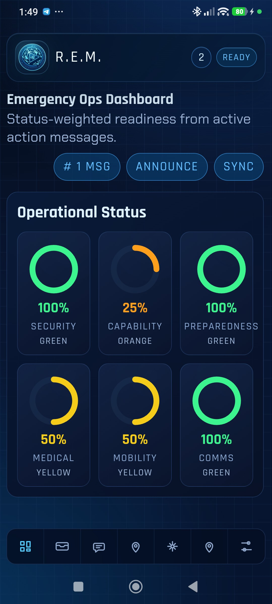
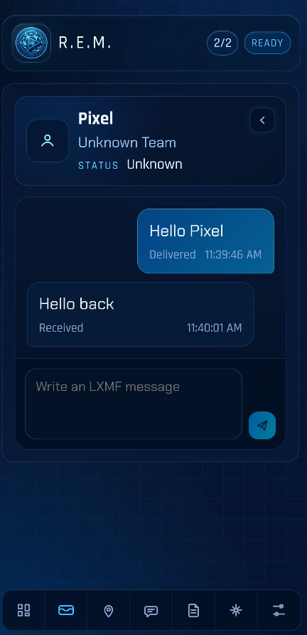
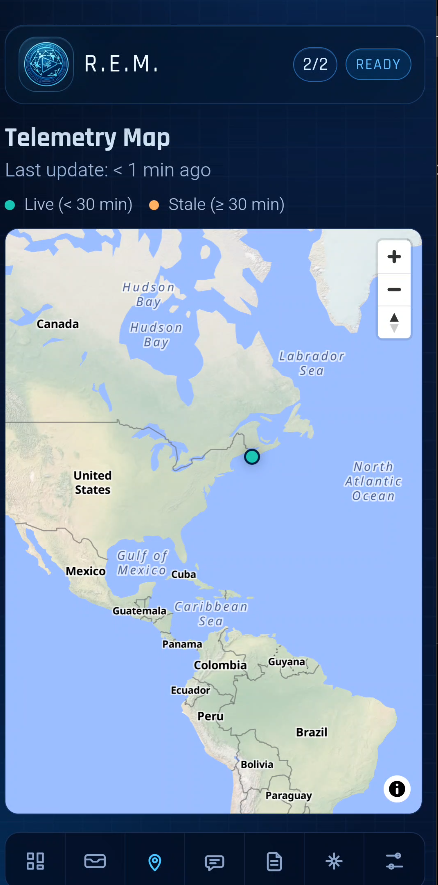
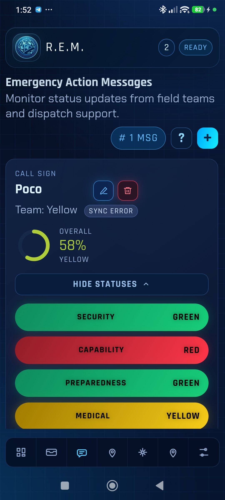
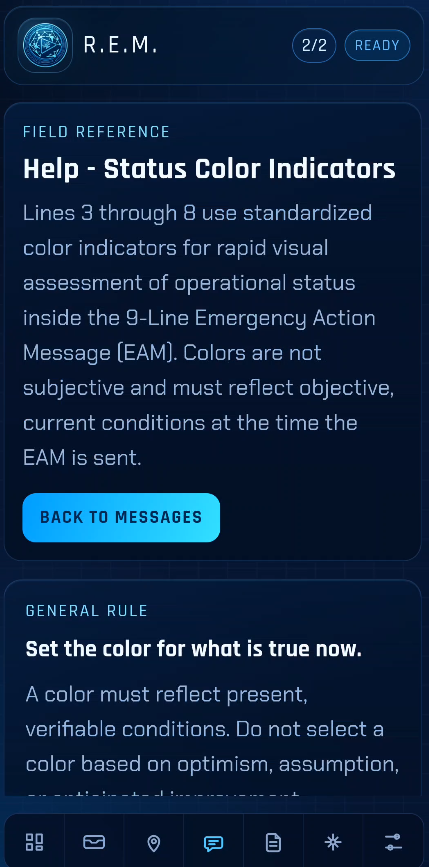
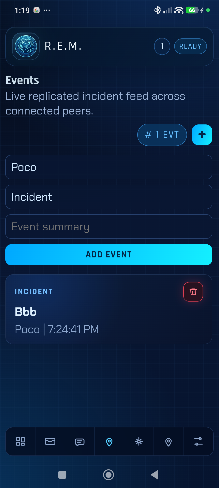
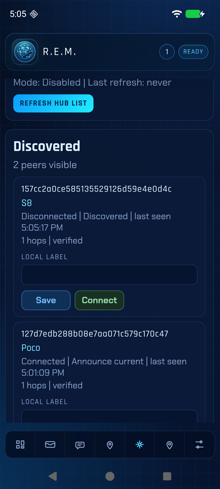
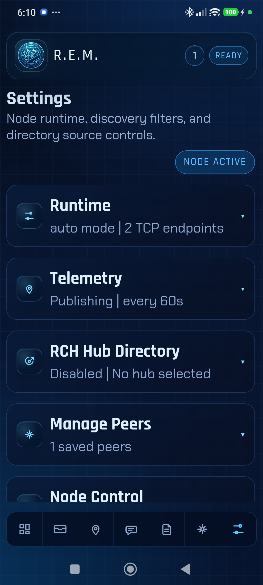

# R.E.M. User Manual

R.E.M. is an emergency-coordination client built for situations where normal communications may be unreliable, degraded, or unavailable. It combines peer discovery, encrypted messaging, structured status reporting, event replication, and telemetry sharing over Reticulum-based networking so a team can continue operating with a shared picture even in contested or disconnected environments.

This manual describes the operator-facing pages in the R.E.M. mobile client and explains the concepts that appear throughout the interface.

## Introduction

R.E.M. is designed for small teams that need to coordinate field activity, exchange status, and maintain situational awareness without depending on conventional internet or cellular infrastructure.

Typical use cases include:

- emergency-management teams operating in a degraded communications environment
- field teams coordinating checkpoints, rally points, supply issues, and medical updates
- small groups that need a local-first, peer-aware operating picture instead of a centralized always-online system

In practice, the app supports a simple operational cycle:

1. Discover and save trusted peers.
2. Connect to the peers you want to work with.
3. Exchange encrypted messages.
4. Publish structured status snapshots and event updates.
5. Watch dashboard and telemetry views for the team-wide picture.

## Core concepts

Before using the page-by-page reference, it helps to understand the main concepts used throughout the app.

### Reticulum

Reticulum is the underlying networking system used by the app. In this app, it provides the encryipted mash  that lets devices discover routes and exchange data across available links.

### Node

The node is the local networking runtime running inside the app. When the UI shows `Ready`, means that the node has started successfully and  operations can proceed. If it is not ready, some actions are blocked or queued for later sync.

### Peer

A peer is another device with compatible software  visible to REM. A regular LXMF client such as Sideband or Columba cannot be a peer.

- A discovered peer has been seen by REM.
- A saved peer is one the operator has explicitly kept in the local allowlist.
- A connected peer is one with an active usable link.

This distinction matters because discovery alone does not imply trust or connectivity.

### LXMF

LXMF is the messaging layer used for operator-to-operator message delivery. In the app, the `Inbox` page is the main LXMF workflow surface.

### Emergency Action Message

An Emergency Action Message, 9 liners or EAM, is a structured status report used to capture readiness across several operational dimensions such as security, capability, medical condition, and communications. These records feed the `Dashboard` view.

### Event

An event is a short replicated timeline entry, such as a road closure, checkpoint update, or logistics note. Events are intended for operational logging and shared awareness rather than direct person-to-person chat.

### Telemetry

This is the live or recent location information published by devices. The app treats telemetry as:

- live when it is still fresh
- stale when it is older than the configured freshness window
- expired when it is old enough to be removed from the visible map

### Hub directory

The Reticulum Community Hub directory configuration in `Settings` controls optional RCH-assisted routing and registration behavior. REM now supports three hub modes:

- `Autonomous`: REM discovers peers locally and sends directly to them.
- `Semi-autonomous`: REM asks the selected RCH for a peer directory, then still contacts those peers directly.
- `Connected`: REM sends outbound traffic only to the selected RCH and the hub redistributes it.

For basic peer-to-peer operation, the most important operator tasks are still peer management, messaging, status reporting, and telemetry.

## App menu

The app uses a single shell across all main pages:

- The top bar shows the app title, saved-peer and connected-peer count, and node readiness.
- The main content area changes based on the selected page.
- The bottom tab bar is the primary navigation.
- The main tabs are `Dashboard`, `Inbox`, `Telemetry`, `Action Messages`, `Events`, `Peers`, and `Settings`.

If the top-right readiness indicator shows `Not Ready`, outbound features may be limited. In particular, events require a ready node before they can be sent. Action messages can still be saved locally and synced later. the two numbers indicate the number of discovered peers and the one that are saved

## Dashboard

Purpose:

- Gives a readiness summary derived from all the stored Emergency Action Messages.
- Helps an operator see the overall status picture without opening each message.

How it works:

- The `# MSG` badge shows the number of active action messages currently contributing to the dashboard.
- Six readiness rings summarize `Security`, `Capability`, `Preparedness`, `Medical`, `Mobility`, and `Comms`.
- Each ring shows a percentage and a color band that represents the average of that status across all active messages.
- `Announce` send information to the mesh  about the operator presence. Announces are sent periodically and this shoul be only used if necessary.
- `Sync` requests to sync immediately messages send by peers while offline.

What to expect:

- If no action messages exist yet, the dashboard shows zero messages and all readiness rings stay at zero.
- The dashboard is only as useful as the action messages currently stored in the app.

## Inbox

Purpose:

- Provides the encrypted one to one conversation view.
- Lets the operator review message threads and send replies to a selected peer.

How it works:

- The left pane lists available conversations.
- The right pane shows the selected thread, target status summary, team label, optional coordinates, and the message composer.
- On smaller screens, the page switches between list and detail panes and exposes a back button inside the thread view.
- The message composer is disabled until a conversation or destination is selected.
- The connected-peer picker can be used to start or switch threads quickly.

What the operator sees:

- Each conversation row shows the display name, last message preview, timestamp, and last known state.
- The thread view shows inbound and outbound message bubbles with their delivery state and time.
- If no conversations exist yet, the page explicitly says so and instructs the operator to discover a peer or receive an LXMF message first.

Operational note:

- Inbox usefulness depends on actual  traffic or an existing conversation being created for a connected peer.

## Telemetry

Purpose:

- Shows live and stale peers position on a map.
- Helps the operator monitor peer locations.

How it works:

- The header shows the most recent telemetry age.
- The legend distinguishes `Live` positions from `Stale` ones using the configured stale threshold.
- Each visible marker represents one non-expired telemetry position.
- tapping a marker opens a popup with the peer label, update time, and optional speed/course data.

What to expect:

- Positions older than the configured expiry window are filtered out and do not appear on the map.
- If no telemetry has been received, the map remains empty and the header reports that no telemetry has been received yet.

## Emergency Action Messages

Purpose:

- Captures and reviews 9-Line Emergency Action Message status updates.
- Acts as the source of truth for the dashboard readiness rings.

How it works:

- The header shows the active message count and, when relevant, a draft count.
- `?` opens the status color help page.
- `+` opens the create/edit form.
- The form includes `Call Sign`, `Team color`, and six status selectors.
- Existing cards show the callsign, team, overall readiness ring, sync state, and a toggle to show detailed status pills.

Operator actions:

- Create a new message.
- Edit a locally managed message.
- Delete a locally managed message.
- Expand a message and tap a status pill to cycle that field through its color states.

Read-only behavior:

- Synced inbound messages are read-only.
- Read-only messages can still be expanded for review, but their status pills cannot be changed and edit/delete controls are hidden.

Offline and startup behavior:

- If the node is not ready, message changes are still saved locally and will sync automatically once the node is ready.
- If hub registration is pending, drafts are retained locally and replay automatically later.

## Help

Purpose:

- Explains how to assign the status colors used in action messages.

How it works:

- The page gives general rules for choosing accurate colors.
- It explains when `Unknown` should be used.
- It defines the meaning of each color for lines 3 through 8:
- `Security Status`
- `Security Capability`
- `Preparedness (Sustainment)`
- `Medical Status`
- `Mobility Status`
- `Communications Status`
- A `Back to Messages` link returns to the main action-messages page.

General rule:

- Set the color for what is true now.
- A color must reflect present, verifiable conditions.
- Do not select a color based on optimism, assumption, or anticipated improvement.
- If reliable information is missing, conflicting, or cannot be confirmed, select `Unknown`.

When to select `Unknown`:

- You lack confirmed information.
- Conditions are changing too rapidly to assess.
- You are unable to perform proper evaluation, for example because of poor visibility or communications limitations.
- Reports are contradictory.
- You are relaying second-hand information without confirmation.

### Line 3: Security Status

Use this line to report the current threat picture around the operator location.

`Red - Threats Imminent`

- Active hostile presence observed or confirmed.
- Gunfire, violent activity, forced entry, or a credible immediate threat.
- Perimeter compromised or under active surveillance by hostile actors.
- Immediate defensive action required.

`Yellow - Not Secure but No Immediate Threat`

- Area unstable due to civil unrest, crime surge, or disaster impact.
- Suspicious activity observed but not confirmed hostile.
- Security perimeter incomplete or degraded.
- You cannot guarantee the safety of the location.

`Green - Secure`

- No active threats observed or reported.
- Controlled access to the area.
- Defensive posture in place.
- Situational awareness maintained.

`Unknown`

- No visual confirmation.
- No reliable reports.
- Environmental conditions prevent assessment.

### Line 4: Security Capability

Describe the ability to defend the position right now, not what might be available later.

`Red - No Defensive Capability`

- No weapons available.
- No trained defenders.
- Defensive tools are non-functional.
- Outnumbered beyond realistic resistance.

`Yellow - Limited Capability`

- Limited ammunition or supplies.
- Limited trained personnel.
- Equipment partially functional.
- Defensive capability sustainable only short-term.

`Green - Fully Capable`

- Weapons available and functional.
- Adequate ammunition.
- Personnel prepared and positioned.
- Defensive posture sustainable.

`Unknown`

- Inventory not confirmed.
- Personnel availability unclear.
- Equipment status unverified.

### Line 5: Preparedness (Sustainment)

Capture the current sustainment picture for food, water, fuel, power, and essential supplies.

`Red - No Sustainment Supplies`

- Food or water is insufficient for 24 hours.
- No fuel, power backup, or essential supplies.
- Immediate resupply required.

`Yellow - Limited Supplies`

- Supplies are available only for a short duration, less than one week.
- Rationing is required.
- Fuel or power is limited.

`Green - Adequate Supplies`

- Food, water, and power are sufficient for an extended period.
- Medical kits are stocked.
- Backup systems are operational.

`Unknown`

- Inventory has not been checked.
- Storage is inaccessible.
- Consumption rate is uncertain.

### Line 6: Medical Status

Report the most severe current medical need affecting the group.

`Red - Urgent Medical Need`

- Life-threatening injury.
- Severe bleeding.
- Respiratory distress.
- Unstable vital signs.
- Immediate evacuation required.

`Yellow - Delayed Care Acceptable`

- Minor fractures.
- Controlled bleeding.
- Manageable illness.
- Stable condition but still requires treatment.

`Green - No Medical Issue`

- No injuries.
- No medical conditions requiring intervention.
- All group members are stable.

`Unknown`

- Full headcount not confirmed.
- Individuals are unaccounted for.
- Medical assessment is incomplete.

### Line 7: Mobility Status

Show the best confirmed movement option available to the group right now.

`Red - No Movement Possible`

- Vehicle is disabled.
- Severe injury prevents movement.
- Security threat prevents relocation.
- Dependents cannot move safely.

`Yellow - Foot Movement Only`

- Vehicles are unavailable.
- Fuel is depleted.
- Roadways are blocked.
- Movement is possible but range and speed are limited.

`Green - Vehicular Movement Capable`

- Vehicles are operational.
- Adequate fuel is available.
- Safe travel routes are identified.

`Unknown`

- Vehicle status is unverified.
- Route conditions are unknown.
- Driver availability is uncertain.

### Line 8: Communications Status

Report communications depth and redundancy, not just whether a single radio is powered on.

`Red - No Alternate Communications`

- Only one communication method is available and it is failing.
- No radio backup.
- No mesh, repeater, or alternate channel.

`Yellow - Handheld (HT) Only`

- Limited to a low-power radio.
- Short-range capability.
- Battery dependent without redundancy.

`Green - Mobile (50W) or Better`

- High-power radio is available.
- Multiple communication paths exist.
- External antenna in use.
- Backup power is available.

`Unknown`

- Equipment status is not verified.
- Channel viability is untested.
- Interference is suspected but not confirmed.

Operational guidance:

- Always select the lowest accurate color when uncertain between two.
- Reassess and resend the EAM if conditions materially change.
- `Unknown` status must be resolved as soon as practical.
- Consistency across group members improves prioritization.
- Color inflation reduces credibility and response efficiency.

## Events

Purpose:

- Maintains the replicated event log / timeline.
- Lets the operator record short operational updates for distribution.

How it works:

- The `# EVT` badge shows the number of stored event entries.
- `+` opens the event form.
- The form contains the configured call sign, event `Type`, and `Event summary`.
- Each event card shows the type, summary, callsign, update time, and a delete action.

Important behavior:

- Events require the node to be ready before a new event can be created.
- If the app is not ready, the add control is disabled and the page keeps the operator on the read-only timeline.
- If there are no events yet, the page shows an explicit empty-state message.

## Peers & Discovery

Purpose:

- Manages discovered peers, saved peers, and manual peer connectivity.
- Provides the main allowlist workflow for peer destinations.

How it works:

- The search box filters by destination, local label, announced name, or related peer text.
- The `Discovered` section lists currently known peers and shows whether each one is saved, connected, stale/current, and when it was last seen.
- Each discovered peer row includes a local-label field plus `Save`/`Unsave` and `Connect`/`Disconnect` actions.
- The `Saved` section groups locally saved peers and adds `Connect all`, `Disconnect all`, and `Remove`.
- The page also includes `Announce`, `Sync`, and `Refresh hub list`.

Important behavior:

- Newly discovered peers are never auto-saved.
- A peer must be saved before it can be connected manually.
- Feedback messages on this page report connect/disconnect failures and other runtime issues directly in the UI.

## Settings

Purpose:

- Central place for node runtime configuration, telemetry settings, hub settings, peer-list import/export, and node control.

How it works:

- The page is divided into collapsible sections.
- The header badge shows whether the node is active.

### Runtime

Use this section to configure:

- client mode
- call sign
- announce capabilities
- announce interval
- auto-connect behavior for saved peers
- broadcast enablement
- TCP community servers and custom TCP endpoints
- active propagation-node summary

Actions:

- `Save`
- `Recreate Client`
- `Restart Node`

### Telemetry

Use this section to configure:

- telemetry enablement
- publish interval
- optional accuracy threshold
- stale threshold
- expiry threshold
- current telemetry loop status

### RCH Hub Directory

Use this section to configure:

- hub mode
- hub identity
- hub selection from announce candidates that advertise the RCH server capability set
- hub refresh interval

Mode behavior:

- `Autonomous` keeps REM on local peer discovery only.
- `Semi-autonomous` uses the selected RCH to populate a transient peer list, then REM still talks to those peers directly.
- `Connected` routes outbound traffic only to the selected RCH.

Actions:

- `Save Hub Settings`
- `Refresh Now`
- `Register Team Member`
- `Clear Registration`

### Manage Peers

Use this section to exchange saved-peer lists:

- load a peer list JSON file
- export the current peer list
- paste PeerListV1 JSON directly
- choose `Merge` or `Replace` on import

### Node Control

Use this section to control the runtime:

- `Start`
- `Stop`
- review runtime feedback and recent node logs

## Typical operator workflow

1. Open `Settings` and confirm the call sign, TCP endpoints, telemetry preferences, and hub mode.
2. Open `Peers` to save the peers you trust and connect to the one you want active connection with.
3. Use `Inbox` for encrypted LXMF traffic once peers and conversations exist.
4. Use `Action Messages` to publish current status snapshots.
5. Use `Dashboard` to monitor the rolled-up readiness picture from those messages.
6. Use `Events` to publish short timeline updates.
7. Use `Telemetry` to monitor current positions when telemetry sharing is enabled and data is being received.

## Notes on empty pages

Several pages are intentionally sparse until live or saved data exists:

- `Dashboard` is empty until action messages exist.
- `Inbox` is empty until conversations exist.
- `Telemetry` is empty until positions are received.
- `Events` is empty until local or replicated event records exist.
- `Peers` becomes more useful after announces are received or peers are saved manually.
