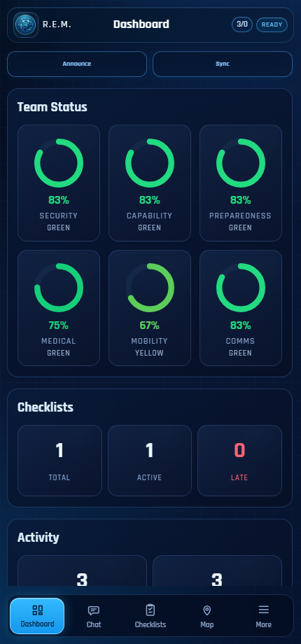
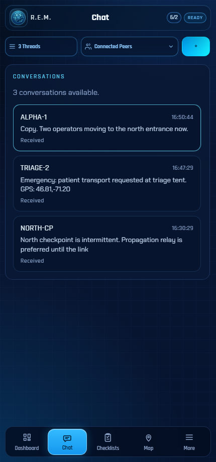
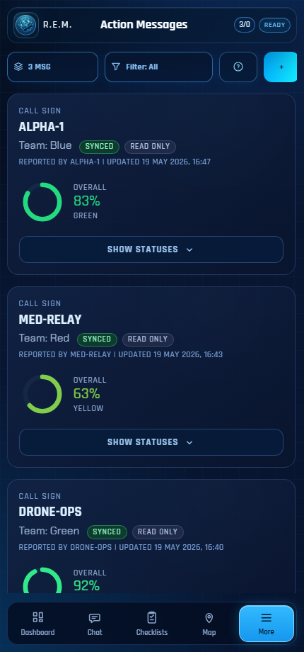
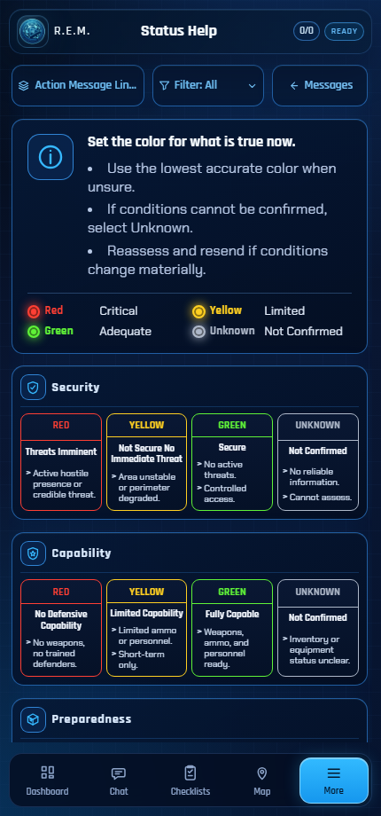
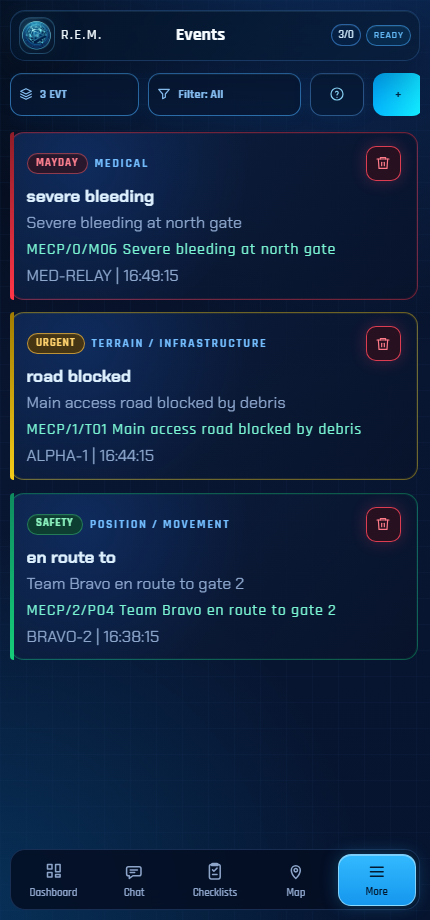
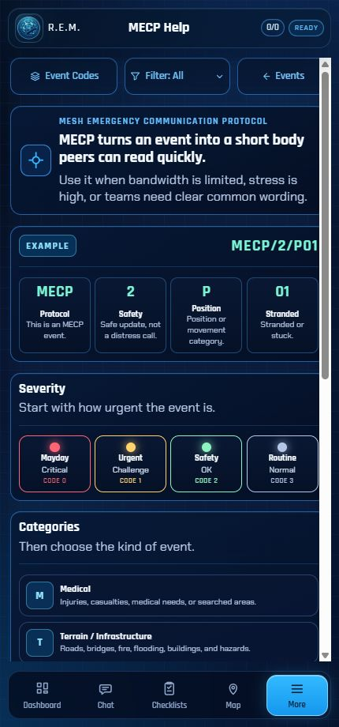
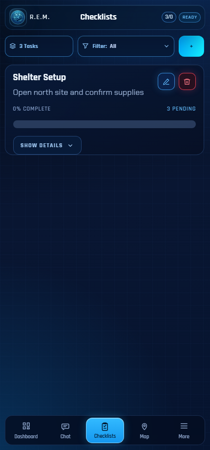
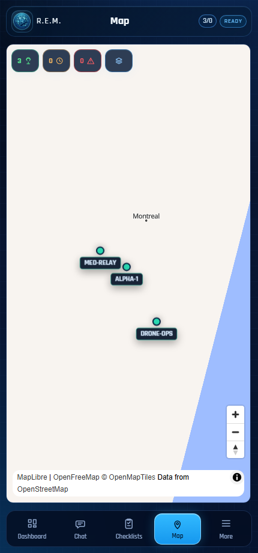
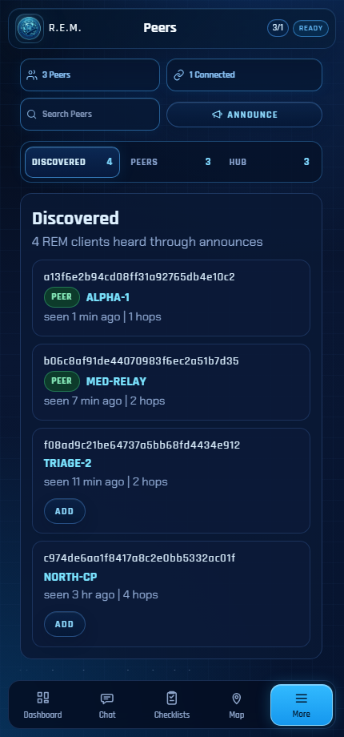
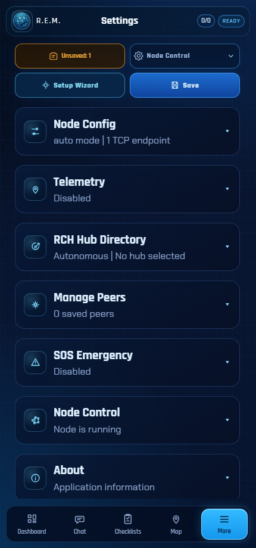

# R.E.M. User Manual

> This Markdown manual is authoritative for REM `1.2.7`. PDF and DOCX
> files in `docs/` are archived snapshots and may describe older screens or
> behavior.

R.E.M. stands for Reticulum Emergency Management.

It is a secure Mesh  coordination app for small teams.  It helps people share status, send chat messages, record events, manage checklists, and see recent positions over Reticulum mesh networking.

This manual uses plain language. It focuses on what each screen is for, what you can do there, and what to expect.

## Quick Start

- Open **Settings** and confirm your call sign.
- Open **Peers** and save the people you trust.
-Use **Chat** for direct messages.
- Use **Action Emergency Messages** to report team status.
- Use **Events** to add short timeline updates.
- Use **Checklists** to track shared tasks.
- Use **Map** to see positions when telemetry is enabled.
- Use **Dashboard** to see the overall picture.

## Main Navigation

The top of the app shows:

- the current page name
- saved peer and connected peer count
- whether REM is **Ready**

If the app says **Not Ready**, the local node has not started. A configured TCP or LoRa interface may still show as unavailable after REM starts; REM remains open and retries that interface in the background, but network sends can fail until an interface reconnects.

The bottom bar gives fast access to:

- **Dashboard**
- **Chat**
- **Checklists**
- **Map**
- **More**

Use **More** to open:

- **Action Messages**
- **Events**
- **Peers**
- **Settings**

## Dashboard

The Dashboard gives a quick team picture.

Use it to see:

- readiness across security, capability, preparedness, medical, mobility, and communications
- checklist totals
- action message and event totals
- quick **Announce** and **Sync** controls

The status rings come from Action Messages. If there are no Action Messages yet, the rings stay at zero.

## Chat

Chat is for direct peer-to-peer messages.

Use it to:

- review conversations
- send a message to a selected peer
- read incoming LXMF messages
- open SOS positions on the Map when an emergency message includes location

If the page is empty, discover and save peers first, or wait for an incoming message.

## Action Messages

Action Messages are structured status reports. They also feed the Dashboard.

Use them to tell the team:

- whether the area is secure
- whether the team has defensive capability
- whether supplies and power are adequate
- whether there is a medical problem
- whether people can move
- whether communications are working

The status colors are:

| Color | Plain meaning |
| --- | --- |
| Red | Immediate problem or serious limit |
| Yellow | Limited, degraded, or needs attention |
| Green | Working or acceptable |
| Unknown | unclear, Not confirmed yet |

Choose the lowest accurate color. Do not choose a better color just because conditions might improve later.

### Status Help

The help page explains how to choose the Action Message colors. Use it when a team needs a shared rule for what Red, Yellow, Green, and Unknown mean.

## Events

Events are short timeline updates. Use them for things the team should know, such as:

- road blocked
- bridge out
- storm approaching
- need water
- stranded
- send rescue
- acknowledged
- drill message

REM Events now use **MECP**, the Mesh Emergency Communication Protocol. MECP is a short text code for emergency and everyday mesh messages. It is designed for low-bandwidth links and for people who may not share the same spoken language. See the MECP project here: [xiang-dev-1/MECP](https://github.com/xiang-dev-1/MECP).

You do not need to memorize MECP codes. REM lets you choose the plain-language options and shows the body before the event is added.

The MECP Help screen explains the short message body, the urgency levels, and the event categories in one place.

### MECP Event Choices

| Part | What you choose | What REM sends |
| --- | --- | --- |
| Severity | Mayday, Urgent, Safety, or Routine | The number after `MECP/` |
| Category | Medical, Terrain, Weather, Supplies, Position, Coordination, Response, Drill, Life, Threat, Resources, or Beacon | The first letter of the event code |
| Event | A specific item, such as Injury, Road blocked, Need water, or Stranded | A short code like `M01`, `T01`, `S01`, or `P01` |
| Details | Optional extra words | Added after the code |
| Body preview | The exact message that will be shared | Example: `MECP/2/P01` |

### MECP Categories

| Code | Category | Used for |
| --- | --- | --- |
| M | Medical | Injuries, bleeding, burns, missing or found people |
| T | Terrain / Infrastructure | Roads, bridges, buildings, flooding, fire, hazards |
| W | Weather / Environment | Storms, visibility, cold, heat, air quality |
| S | Supplies | Water, food, medication, fuel, tools, power |
| P | Position / Movement | Stranded, evacuating, sheltering, en route, lost |
| C | Coordination | Send rescue, relay, confirm received, rendezvous |
| R | Response | Acknowledged, help coming, ETA, all clear |
| D | Drill / Test | Drill, test, end of drill, sent in error |
| L | Life / Leisure | Low-risk everyday messages that help people practice |
| X | Threat / Security | Unsafe areas, dangerous people, unrest, checkpoints |
| H | Have / Offer Resources | Available water, food, medical supplies, shelter, transport |
| B | Beacon | Distress beacon, beacon acknowledged, cancel beacon |

### How To Add An Event

1. Open **Events**.
2. Tap **+**.
3. Choose the severity.
4. Choose the category.
5. Choose the event.
6. Add optional details if needed.
7. Review the **Body** preview.
8. Tap **Add Event**.

Events require the node to be Ready before they can be sent.

## Checklists

Checklists are shared task lists.

Use them to:

- create a task list from a template
- upload a CSV checklist template
- track active, late, and completed tasks
- open a checklist and mark rows complete
- share task updates with peers

The checklist page shows task counts and a filter. If no checklist data is loaded yet, the page tells you that nothing is available.

### Creating A Checklist

1. Open **Checklists**.
2. Tap **+**.
3. Enter a title.
4. Add a subtitle or assignment label if useful.
5. Choose the checklist date and time.
6. (optional) Choose a template.
7. Tap **Create checklist**.

## Map

The Map shows recent peer positions when telemetry is available.

Use it to:

- see live or recent positions
- open emergency locations from SOS messages
- review position age
- tell whether a location is fresh or stale

If nobody has shared telemetry yet, the map may be empty.

## Peers

Peers are other REM-capable devices.

Use the Peers page to:

- see discovered REM clients
- save trusted peers
- connect or disconnect saved peers
- search peer names or destination text
- review hub directory entries when hub support is in use
- announce your presence
- select the active color team from the menu beside **Announce**
- search and connect peers in the active roster
- open **Manage Teams** for local aliases, membership, and sharing

Discovery does not mean trust. Save only the peers you want to work with.

In **Semi-autonomous** RCH mode, REM downloads the TEAM-scoped peer directory
at the configured hub refresh interval and keeps the latest successful result
as a local membership allowlist. REM determines which listed peers are active
from local announces and link state; it does not query the hub for every send
or trust the hub's presence label. A failed refresh keeps the last successful
directory. A node that has never downloaded a valid directory pauses team
fanout until a refresh succeeds. **Autonomous** mode continues to use locally
managed peers, while **Connected** mode sends through the selected hub.

A connected peer remains reachable while its link is active. Without an active
link, REM waits for the configured announce interval plus a short scheduling
grace before marking peer presence stale. With the default 1800-second announce
interval, no earlier proof of life is expected.

### Teams And Peer Sharing

The selector on the Peers page chooses one active team for all outbound chat,
Action Messages, Events, checklists, telemetry, SOS, and EAM fanout. Existing
records and timelines stay visible when the team changes; teams control
recipients, not storage.

Yellow always exists. Existing saved peers move into local Yellow during the
one-time upgrade. Open **Settings → Manage Teams** (or tap **Manage Teams** on
the Peers tab) to create any unused canonical color locally, then add a saved
peer to one or several local teams. RCH memberships remain read-only. If REM
and RCH both provide the same color, their members appear in one merged,
deduplicated roster.

You may give a team a local alias, such as `Medical`, from its Manage Teams
detail. The alias is stored only on that device and is never shared. Local
membership can be added or removed in REM, but ask the RCH operator to change
RCH membership. Removing a saved peer removes it from every local team without
changing RCH.

Use the QR action beside a local team to display its code. On the other REM
client, open **Manage Teams**, tap **Scan QR**, and point the camera at the
code. Import creates any missing saved-peer records and merges the roster into
the matching color; it does not replace an existing local alias. QR codes
contain the canonical color and at most 40 member destinations; local aliases
and peer labels stay private. For a larger roster, open the team detail and use
**Export**, then open **Add Team → Import team JSON** on the other device.

If the selected roster is missing or empty, REM deliberately sends to nobody
rather than falling back to every discovered peer. In Connected mode, non-Yellow
teams require an RCH that supports the version 2 TEAM directory contract.

## Settings

Settings is where you prepare the app before field use.

Use it to configure:

- call sign
- Reticulum network access
- announce behavior
- telemetry sharing
- checklist timing defaults
- RCH hub mode
- peer list import and export
- SOS emergency options
- node start, stop, and restart controls

## SOS Emergency

SOS is for urgent distress messages.

When enabled, it can:

- show a floating SOS button
- send the configured emergency message to saved peers
- include battery information
- include  position if a recent fix is available
- keep sending updates while the emergency is active

- require a PIN to cancel, if configured

Before relying on SOS, test it with trusted peers in a safe setting.

## Examples

These examples use the current Android release. Button names can be slightly
different on narrow screens, but the sequence and recovery rules are the same.

### First Launch With TCP Or Autonomous Operation

1. Open REM and complete the setup wizard. Enter a unique call sign.
2. For normal internet or LAN access, keep **TCP** enabled and select a
   community server or enter `host:port`. For an isolated team, remove TCP
   endpoints and choose **Autonomous** mode.
3. Enable an RNode only after its BLE, USB, or TCP connection has been selected
   and tested. Save the settings.
4. Start or restart REM. The splash closes when the local Rust runtime is
   ready. A configured interface can still say **Pending**, **Failed**, or
   **Unsupported**; this is degraded network access, not a blocked app.
5. Open **Settings > Node** to inspect each interface. Correct the endpoint,
   radio selection, Android permission, or cable, then restart REM if needed.

If RCH is disabled, misconfigured, or temporarily unreachable, Autonomous and
local TCP operation still start. RCH directory refresh retries separately and
must not keep the splash screen open.

### Discover, Save, Connect, And Chat

1. On both phones, open **Peers** and tap **Announce**.
2. Confirm each call sign appears with REM/LXMF capability evidence.
3. Save the other phone on both devices. Discovery alone does not grant trust.
4. Tap **Connect** and wait for **Connected**. **Reachable** means a route is
   known, but it is not the same as an active direct link.
5. Open **Chat**, select the saved peer, send `CHAT-TEST-01`, and confirm it is
   received in the matching conversation.
6. Watch the delivery state. `Delivered`, `Failed`, `TimedOut`, and `Cancelled`
   are terminal. Retry only failed or timed-out messages after correcting the
   route; do not resend a delivered message.

### Create, Share, And Use A Team

1. Open **Settings → Manage Teams** and tap **Add Team**. Choose an unused
   canonical color, optionally enter a private local name such as `Family`,
   and tap **Create team**. Open the new team and add one or more saved peers;
   the same peer may belong to several local teams.
2. To share by QR, tap the QR action beside the local team. On the other phone,
   open **Manage Teams**, tap **Scan QR**, allow camera access if prompted, and
   scan the code. The color membership merges, but your local name and peer
   labels are not transmitted. Up to 40 peers fit in one team QR.
3. For a larger roster or a non-camera transfer, open the team detail and tap
   **Export**. On the other device, open **Add Team → Import team JSON**, paste
   the payload, and tap **Import team**.
4. For RCH teams, ask the operator to assign both REM clients to canonical
   colors. Start REM with that RCH selected and refresh the hub directory if
   the expected sections are not yet visible. A local and RCH team of the same
   color appear together; for example, local Blue members merge with RCH Blue.
5. Return to **Peers**, open the styled active-team menu beside **Announce**,
   and select the desired color. The Peers tab shows only that active roster.
   Connect reachable members individually. A member may remain listed while
   offline because the cached destination is durable.
6. Send a uniquely marked chat or Event. Only members of the active merged team
   are eligible recipients.
7. If an RCH refresh fails, REM retains the last directory for that hub. If the hub is
   replaced, or your membership is removed, refresh and resolve the setup error
   with the RCH operator; REM does not reuse another hub's roster. Local teams
   remain available without RCH.

### Create An EAM And A MECP Event

1. Select the intended team on **Peers**. Open **Action Messages**, tap **+**,
   enter a call sign, and choose the most
   accurate Security, Capability, Preparedness, Medical, Mobility, and Comms
   states. The active team is applied automatically; there is no editable team
   selector in the EAM form. Save the EAM and confirm the Dashboard rings update.
2. Open **Events**, tap **+**, and choose severity, category, and event. For
   example, Safety + Position + Stranded produces `MECP/2/P01`.
3. Add a unique detail such as `RIDGE-01`, review the body, and tap **Add
   Event**.
4. Confirm the saved peer receives one EAM projection and one event row with
   the same marker. If delivery fails, reconnect the peer or propagation node
   and use the item status rather than creating a duplicate.

### Create And Synchronize A Checklist

1. Open **Checklists**, tap **+**, enter a title such as `SEARCH-A-01`, and
   select a built-in or imported CSV template.
2. Set the start time and create the checklist. Open it and assign or update a
   row.
3. Ensure both phones saved each other, then use **Upload/Sync** when shown.
4. On the second phone, join the checklist and change one task to **Complete**.
5. Confirm the creator receives the same task state and that repeating the
   update does not create a duplicate row.
6. A timed-out synchronization is safe to retry. Do not delete and recreate the
   checklist unless the original is intentionally abandoned, because its UID
   is the replication identity.

### Activate, Update, Cancel, And Recover SOS

1. In **Settings > SOS**, configure the emergency and cancellation text,
   trusted recipients, location/update choices, and an optional cancellation
   PIN. Test this in a safe exercise first.
2. Activate SOS from the configured control. Wait through the countdown and
   confirm the active SOS indicator appears.
3. If location or battery data changes, send or wait for the configured update.
   The receiving phone should update the existing incident rather than create
   duplicate active alerts.
4. Cancel SOS and enter the PIN when required. Confirm peers show the incident
   as cancelled and the Map no longer treats its position as active.
5. If activation or cancellation reports a retryable network error, keep the
   local incident state, restore an interface or propagation route, and retry.
   If the app restarts during an active incident, inspect **SOS Status** before
   taking another action; REM restores persisted incident state.
6. For a non-retryable configuration error, correct the recipient, PIN, or
   permission first. Never assume a failed local send reached the team.

## Typical Field Workflow

1. Set your call sign in **Settings**.
2. Confirm networking and telemetry choices.
3. Save trusted devices in **Peers**.
4. Send or receive a chat message to confirm contact.
5. Create an Action Message for your current team status.
6. Watch the Dashboard for the group picture.
7. Add Events when something important changes.
8. Use Checklists for assigned work.
9. Use the Map when location sharing is part of the plan.

## Empty Screens

Some pages start empty on purpose.

| Screen | Why it may be empty |
| --- | --- |
| Dashboard | No Action Messages or activity yet |
| Chat | No conversations yet |
| Checklists | No checklist data or templates loaded yet |
| Map | No telemetry received yet |
| Events | No local or shared events yet |
| Peers | No REM announces heard yet |

An empty screen does not always mean something is wrong. It often means the app is waiting for local data, peer traffic, or a ready node.

## Glossary

| Term | Plain meaning |
| --- | --- |
| Action Message | A structured team status report. It feeds the Dashboard status rings. |
| Announce | A Mesh signal that tells REM devices that your device is online. |
| Call sign | The name your team sees for your device. |
| Checklist | A shared task list used to track work during an operation. |
| Connected peer | A saved peer that REM currently has an active connection with. |
| Dashboard | The screen that summarizes team status, checklist counts, and recent activity. |
| Destination | The Reticulum cryptographic address used to reach a device. |
| Event | A short timeline update about something relevant. |
| LXMF | The message protocol used by Reticulum for direct or delayed messages. |
| Map | The screen that shows recent positions when telemetry is available. |
| MECP | Mesh Emergency Communication Protocol. A short text format for clear emergency and field messages. |
| Node | The local Reticulum part of REM that sends, receives, announces, and connects. |
| Peer | Another REM-capable device or operator. |
| Ready | REM is prepared to send and receive through the local node. |
| RCH | Reticulum Community Hub. A hub service that can help with directory and connected-mode workflows. |
| Reticulum | The mesh networking system REM uses to communicate without normal internet protocol. |
| Saved peer | A peer you have chosen to trust and work with. |
| Selected peer | A peer you have chosen as a sharing target. In the current version, they also need to select you for two-way sharing. |
| SOS | An emergency mode for sending urgent distress information to trusted peers. |
| Telemetry | Position information, such as a recent location shown on the Map. |
